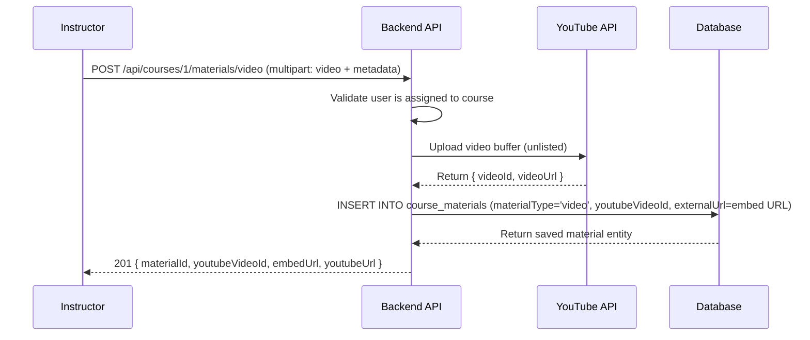
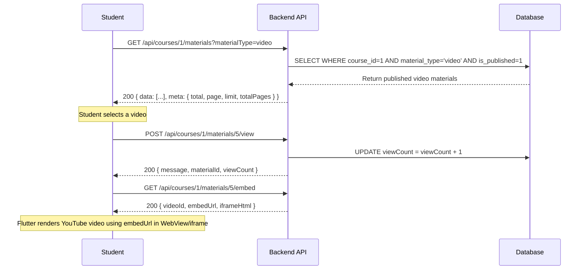
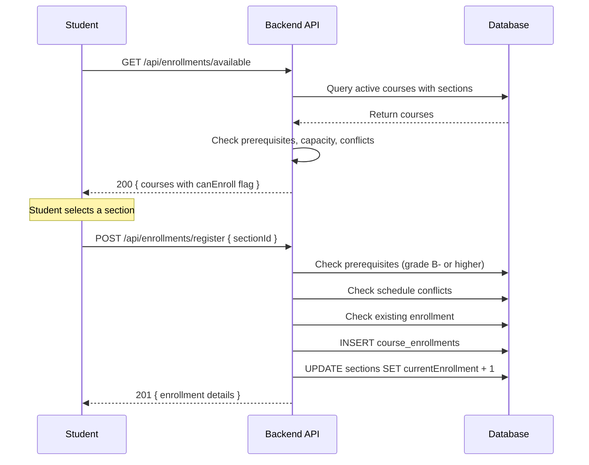
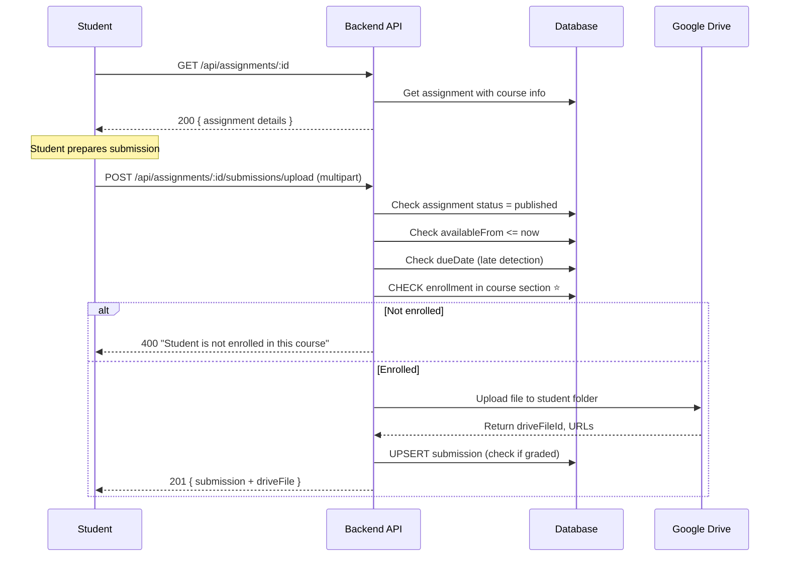
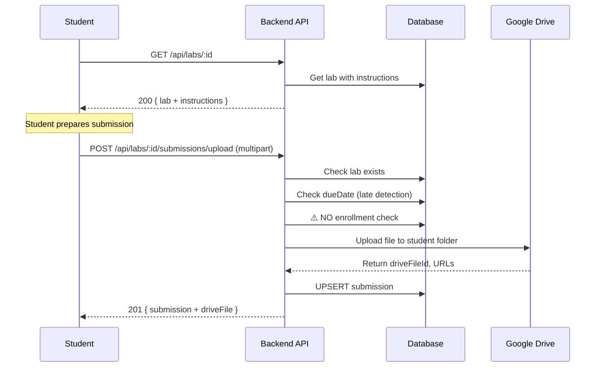
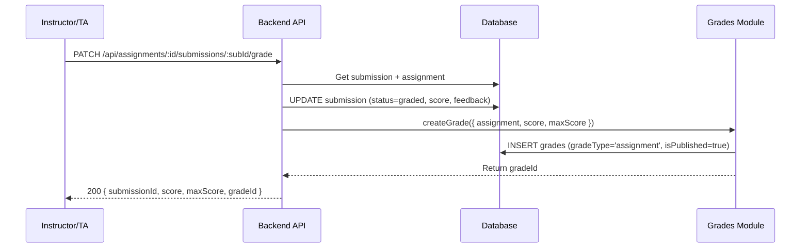

# 📖 EduVerse API Documentation — Courses / Assignments / Labs

> **Purpose**: Complete Flutter frontend integration guide.
> **Base URL**: `http://<host>:3001` (default port `3001`)
> **Auth**: Most endpoints require `Authorization: Bearer <JWT>` header.
> **Content-Type**: `application/json` unless otherwise noted (file uploads use `multipart/form-data`).

---

## Table of Contents

1. [Global Information](#1-global-information)
2. [Enums Reference](#2-enums-reference)
3. [Courses Module](#3-courses-module)
4. [Course Sections Module](#4-course-sections-module)
5. [Course Schedules Module](#5-course-schedules-module)
6. [Assignments Module](#6-assignments-module)
7. [Labs Module](#7-labs-module)
8. [Role-Based Access Matrix](#8-role-based-access-matrix)
9. [Error Handling](#9-error-handling)
10. [Flutter Integration Tips](#10-flutter-integration-tips)
11. [Course Materials & Video Lectures Module](#11-course-materials--video-lectures-module)
12. [Course Structure Module](#12-course-structure-module)
13. [YouTube Integration Module](#13-youtube-integration-module)

---

## 1. Global Information

### 1.1 Authentication

All **authenticated endpoints** require the header:

```
Authorization: Bearer <access_token>
```

The token is obtained from `POST /api/auth/login`.

### 1.2 Roles

| Role Enum Value | Display Name | Description |
|---|---|---|
| `student` | Student | Regular student users |
| `instructor` | Instructor | Faculty members |
| `teaching_assistant` | TA | Teaching assistants |
| `admin` | Admin | Administrative staff |
| `it_admin` | IT Admin | Full system access |
| `department_head` | Department Head | Department leadership |

### 1.3 Pagination Response Shape

All paginated endpoints return:

```json
{
  "data": [ /* array of items */ ],
  "meta": {
    "total": 150,       // integer — total matching records
    "page": 1,          // integer — current page number
    "limit": 20,        // integer — items per page
    "totalPages": 8     // integer — total number of pages
  }
}
```

### 1.4 Validation Rules

The API uses `class-validator` with:
- `whitelist: true` — unknown properties are **stripped**
- `forbidNonWhitelisted: true` — unknown properties cause **400 error**
- `transform: true` — query strings auto-converted to proper types

---

## 2. Enums Reference

### 2.1 Course Enums

#### CourseLevel
| Value | Description |
|---|---|
| `FRESHMAN` | Freshman-level course |
| `SOPHOMORE` | Sophomore-level course |
| `JUNIOR` | Junior-level course |
| `SENIOR` | Senior-level course |
| `GRADUATE` | Graduate-level course |

#### CourseStatus
| Value | Description |
|---|---|
| `ACTIVE` | Course is currently active |
| `INACTIVE` | Course is inactive |
| `ARCHIVED` | Course is archived |

#### SectionStatus
| Value | Description |
|---|---|
| `OPEN` | Section accepting enrollments |
| `CLOSED` | Section manually closed |
| `FULL` | Section at max capacity |
| `CANCELLED` | Section cancelled |

#### ScheduleType
| Value | Description |
|---|---|
| `LECTURE` | Lecture session |
| `LAB` | Laboratory session |
| `TUTORIAL` | Tutorial/recitation session |
| `EXAM` | Examination session |

#### DayOfWeek
| Value |
|---|
| `MONDAY` |
| `TUESDAY` |
| `WEDNESDAY` |
| `THURSDAY` |
| `FRIDAY` |
| `SATURDAY` |
| `SUNDAY` |

### 2.2 Assignment Enums

#### SubmissionType
| Value | Description |
|---|---|
| `file` | File-based submission |
| `text` | Text-based submission |
| `link` | Link/URL submission |
| `multiple` | Combination of types |

#### AssignmentStatus
| Value | Description |
|---|---|
| `draft` | Not visible to students |
| `published` | Visible and accepting submissions |
| `closed` | No longer accepting submissions |
| `archived` | Hidden from all views |

> **Status Transitions**: `draft` → `published` → `closed` → `archived` (one-way only)

#### SubmissionStatus
| Value | Description |
|---|---|
| `submitted` | Student has submitted |
| `graded` | Submission has been graded |
| `returned` | Returned to student for review |
| `resubmit` | Student must resubmit |

### 2.3 Lab Enums

#### LabStatus
| Value | Description |
|---|---|
| `draft` | Not visible to students |
| `published` | Visible and accepting submissions |
| `closed` | No longer accepting submissions |
| `archived` | Hidden from all views |

#### LabSubmissionStatus
| Value | Description |
|---|---|
| `submitted` | Student has submitted |
| `graded` | Submission has been graded |
| `returned` | Returned to student |
| `resubmit` | Student must resubmit |

#### LabAttendanceStatus
| Value | Description |
|---|---|
| `present` | Student was present |
| `absent` | Student was absent |
| `excused` | Excused absence |
| `late` | Student arrived late |

---

## 3. Courses Module

**Base Path**: `/api/courses`

> **Authentication**: Courses listing/viewing endpoints are **public** (no auth required).
> Course creation/update/delete endpoints need authentication and specific roles.

---

### 3.1 List All Courses

```
GET /api/courses
```

**Auth Required**: ❌ No (Public)
**Roles**: All (public endpoint)

#### Query Parameters

| Parameter | Type | Required | Default | Description |
|---|---|---|---|---|
| `departmentId` | `integer` | ❌ | — | Filter by department ID |
| `level` | `string` | ❌ | — | Filter by course level enum (e.g. `FRESHMAN`, `GRADUATE`) |
| `status` | `string` | ❌ | — | Filter by `CourseStatus` enum (`ACTIVE`, `INACTIVE`, `ARCHIVED`) |
| `search` | `string` | ❌ | — | Search in course name or code (partial match) |
| `page` | `integer` | ❌ | `1` | Page number (1-indexed) |
| `limit` | `integer` | ❌ | `20` | Items per page (max 100) |

#### Response `200 OK`

```json
{
  "data": [
    {
      "id": 1,                              // number — Course ID (bigint)
      "departmentId": 3,                    // number — FK to departments
      "name": "Introduction to CS",         // string — Course name
      "code": "CS101",                      // string — Unique course code
      "description": "Fundamentals of...",  // string | null — Description
      "credits": 3,                         // number — Credit hours (1-6)
      "level": "FRESHMAN",                  // string — CourseLevel enum
      "syllabusUrl": "https://...",         // string | null — Syllabus URL
      "instructorId": 5,                    // number | null — Assigned instructor
      "taIds": [1, 2],                      // number[] | null — Assigned TA IDs
      "status": "ACTIVE",                   // string — CourseStatus enum
      "createdAt": "2025-01-15T10:00:00Z",  // string (ISO 8601) — Creation timestamp
      "updatedAt": "2025-01-15T10:00:00Z",  // string (ISO 8601) — Last update
      "department": {                        // object — Joined department info
        "id": 3,
        "name": "Computer Science",
        "code": "CS"
      }
    }
  ],
  "meta": {
    "total": 42,
    "page": 1,
    "limit": 20,
    "totalPages": 3
  }
}
```

---

### 3.2 Get Courses by Department

```
GET /api/courses/department/:deptId
```

**Auth Required**: ❌ No (Public)
**Roles**: All

#### Path Parameters

| Parameter | Type | Required | Description |
|---|---|---|---|
| `deptId` | `integer` | ✅ | Department ID |

#### Response `200 OK`

Returns an **array** of course objects (same shape as items in `data` array above, including `department` relation).

#### Error Responses

| Status | Description |
|---|---|
| `404` | Department not found |

---

### 3.3 Get Course by ID

```
GET /api/courses/:id
```

**Auth Required**: ❌ No (Public)
**Roles**: All

#### Path Parameters

| Parameter | Type | Required | Description |
|---|---|---|---|
| `id` | `integer` | ✅ | Course ID |

#### Response `200 OK`

```json
{
  "id": 1,
  "departmentId": 3,
  "name": "Introduction to CS",
  "code": "CS101",
  "description": "Fundamentals of programming...",
  "credits": 3,
  "level": "FRESHMAN",
  "syllabusUrl": "https://example.com/syllabus.pdf",
  "instructorId": 5,
  "taIds": [1, 2],
  "status": "ACTIVE",
  "createdAt": "2025-01-15T10:00:00Z",
  "updatedAt": "2025-01-15T10:00:00Z",
  "department": {
    "id": 3,
    "name": "Computer Science",
    "code": "CS"
  },
  "prerequisites": [],         // CoursePrerequisite[] — loaded relation
  "sections": [],              // CourseSection[] — loaded relation
  "prerequisitesCount": 0,     // number — count of prerequisites
  "sectionsCount": 2           // number — count of active sections
}
```

#### Error Responses

| Status | Description |
|---|---|
| `404` | Course not found |

---

### 3.4 Create Course

```
POST /api/courses
```

**Auth Required**: ✅ Yes
**Roles**: `admin`, `it_admin`, `instructor`

#### Request Body (`application/json`)

| Field | Type | Required | Constraints | Description |
|---|---|---|---|---|
| `departmentId` | `number` | ✅ | Must exist | Department to assign course to |
| `name` | `string` | ✅ | — | Course name |
| `code` | `string` | ✅ | 2-10 uppercase alphanumeric (`/^[A-Z0-9]{2,10}$/`) | Unique course code |
| `description` | `string` | ✅ | — | Course description |
| `credits` | `integer` | ✅ | 1–6 | Credit hours |
| `level` | `string` | ✅ | `CourseLevel` enum | Course level |
| `syllabusUrl` | `string` | ❌ | Valid URL | Syllabus URL |
| `instructorId` | `number` | ❌ | Must reference valid user | Instructor user ID |
| `taIds` | `number[]` | ❌ | Array of valid user IDs | TA user IDs |

#### Example Request

```json
{
  "departmentId": 1,
  "name": "Introduction to Computer Science",
  "code": "CS101",
  "description": "Fundamentals of programming and computational thinking.",
  "credits": 3,
  "level": "FRESHMAN",
  "syllabusUrl": "https://example.com/syllabus/cs101.pdf",
  "instructorId": 5,
  "taIds": [10, 11]
}
```

#### Response `201 Created`

Returns the created course object (same shape as Get Course by ID, without `prerequisitesCount`/`sectionsCount`).

#### Error Responses

| Status | Description |
|---|---|
| `400` | Invalid input data / validation failure |
| `404` | Department not found |
| `409` | Course code already exists in department |

---

### 3.5 Update Course

```
PATCH /api/courses/:id
```

**Auth Required**: ✅ Yes
**Roles**: `admin`, `it_admin`, `instructor`

#### Path Parameters

| Parameter | Type | Required | Description |
|---|---|---|---|
| `id` | `integer` | ✅ | Course ID |

#### Request Body (`application/json`) — All fields optional

| Field | Type | Required | Constraints | Description |
|---|---|---|---|---|
| `name` | `string` | ❌ | — | Updated course name |
| `description` | `string` | ❌ | — | Updated description |
| `credits` | `integer` | ❌ | 1–6 | Updated credit hours |
| `level` | `string` | ❌ | `CourseLevel` enum | Updated course level |
| `syllabusUrl` | `string` | ❌ | — | Updated syllabus URL |
| `status` | `string` | ❌ | `CourseStatus` enum | Change course status |
| `instructorId` | `number` | ❌ | — | Change instructor |
| `taIds` | `number[]` | ❌ | — | Change TAs |

#### Response `200 OK`

Returns the updated course object.

#### Error Responses

| Status | Description |
|---|---|
| `400` | Invalid input data |
| `404` | Course not found |

---

### 3.6 Delete Course (Soft Delete)

```
DELETE /api/courses/:id
```

**Auth Required**: ✅ Yes
**Roles**: `admin`, `it_admin`

#### Path Parameters

| Parameter | Type | Required | Description |
|---|---|---|---|
| `id` | `integer` | ✅ | Course ID |

#### Response `204 No Content`

Empty body.

#### Error Responses

| Status | Description |
|---|---|
| `400` | Cannot delete course with active enrollments |
| `404` | Course not found |

---

### 3.7 Get Course Prerequisites

```
GET /api/courses/:id/prerequisites
```

**Auth Required**: ❌ No (Public)
**Roles**: All

#### Path Parameters

| Parameter | Type | Required | Description |
|---|---|---|---|
| `id` | `integer` | ✅ | Course ID |

#### Response `200 OK`

```json
[
  {
    "id": 1,                          // number — Prerequisite record ID
    "courseId": 5,                     // number — The course that has this prerequisite
    "prerequisiteCourseId": 2,         // number — The required prereq course ID
    "isMandatory": true,               // boolean — Whether this prereq is mandatory
    "prerequisiteCourse": {            // object — Joined prerequisite course info
      "id": 2,
      "name": "Programming Basics",
      "code": "CS100",
      "level": "FRESHMAN"
    },
    "createdAt": "2025-01-10T08:00:00Z"   // string (ISO 8601)
  }
]
```

---

### 3.8 Add Prerequisite

```
POST /api/courses/:id/prerequisites
```

**Auth Required**: ✅ Yes
**Roles**: `admin`, `it_admin`

#### Path Parameters

| Parameter | Type | Required | Description |
|---|---|---|---|
| `id` | `integer` | ✅ | Course ID to add prerequisite to |

#### Request Body

| Field | Type | Required | Description |
|---|---|---|---|
| `prerequisiteCourseId` | `number` | ✅ | ID of the prerequisite course |
| `isMandatory` | `boolean` | ✅ | Whether this prerequisite is mandatory |

#### Example Request

```json
{
  "prerequisiteCourseId": 2,
  "isMandatory": true
}
```

#### Response `201 Created`

Returns the created prerequisite record.

#### Error Responses

| Status | Description |
|---|---|
| `400` | Circular dependency detected / Self-prerequisite |
| `404` | Course or prerequisite course not found |
| `409` | Prerequisite already exists |

---

### 3.9 Remove Prerequisite

```
DELETE /api/courses/:id/prerequisites/:prereqId
```

**Auth Required**: ✅ Yes
**Roles**: `admin`, `it_admin`

#### Path Parameters

| Parameter | Type | Required | Description |
|---|---|---|---|
| `id` | `integer` | ✅ | Course ID |
| `prereqId` | `integer` | ✅ | Prerequisite record ID |

#### Response `204 No Content`

Empty body.

---

## 4. Course Sections Module

**Base Path**: `/api/sections`

---

### 4.1 Get Sections by Course

```
GET /api/sections/course/:courseId
```

**Auth Required**: ❌ No (Public)
**Roles**: All

#### Path Parameters

| Parameter | Type | Required | Description |
|---|---|---|---|
| `courseId` | `integer` | ✅ | Course ID |

#### Query Parameters

| Parameter | Type | Required | Default | Description |
|---|---|---|---|---|
| `semesterId` | `integer` | ❌ | — | Filter by semester |

#### Response `200 OK`

```json
[
  {
    "id": 11,                              // number — Section ID (bigint)
    "courseId": 1,                          // number — FK to courses
    "semesterId": 1,                       // number — FK to semesters
    "sectionNumber": "1",                  // string — Section number
    "maxCapacity": 30,                     // number — Maximum students
    "currentEnrollment": 25,               // number — Currently enrolled
    "location": "Room A101",               // string | null — Room/location
    "status": "OPEN",                      // string — SectionStatus enum
    "createdAt": "2025-01-15T10:00:00Z",
    "updatedAt": "2025-01-15T10:00:00Z",
    "course": {
      "id": 1,
      "name": "Introduction to CS",
      "code": "CS101"
    },
    "semester": {
      "id": 1,
      "name": "Fall 2025",
      "startDate": "2025-09-01",
      "endDate": "2025-12-15"
    },
    "schedules": [
      {
        "id": 1,
        "dayOfWeek": "MONDAY",            // DayOfWeek enum
        "startTime": "09:00",             // string (HH:mm)
        "endTime": "10:30",               // string (HH:mm)
        "room": "A101",                   // string | null
        "building": "Main Building",      // string | null
        "scheduleType": "LECTURE"          // ScheduleType enum
      }
    ]
  }
]
```

---

### 4.2 Get Section by ID

```
GET /api/sections/:id
```

**Auth Required**: ❌ No (Public)
**Roles**: All

#### Path Parameters

| Parameter | Type | Required | Description |
|---|---|---|---|
| `id` | `integer` | ✅ | Section ID |

#### Response `200 OK`

Same shape as a single item from the array above (includes `course`, `semester`, `schedules` relations).

---

### 4.3 Create Section

```
POST /api/sections
```

**Auth Required**: ✅ Yes
**Roles**: `admin`, `it_admin`, `instructor`

#### Request Body

| Field | Type | Required | Default | Constraints | Description |
|---|---|---|---|---|---|
| `courseId` | `number` | ✅ | — | Must exist | Course to create section for |
| `semesterId` | `number` | ✅ | — | Must exist | Semester ID |
| `sectionNumber` | `integer` | ❌ | Auto-generated | >= 1 | Section number |
| `maxCapacity` | `integer` | ✅ | — | >= 1 | Maximum student capacity |
| `currentEnrollment` | `integer` | ❌ | `0` | >= 0 | Current enrollment count |
| `location` | `string` | ❌ | `null` | — | Room/location |

#### Example Request

```json
{
  "courseId": 1,
  "semesterId": 1,
  "maxCapacity": 30,
  "location": "Room A101"
}
```

#### Response `201 Created`

Returns the created section object.

#### Error Responses

| Status | Description |
|---|---|
| `400` | Invalid input data |
| `404` | Course or semester not found |
| `409` | Section number already exists for this course/semester combo |

---

### 4.4 Update Section

```
PATCH /api/sections/:id
```

**Auth Required**: ✅ Yes
**Roles**: `admin`, `it_admin`, `instructor` (section owner)

#### Path Parameters

| Parameter | Type | Required | Description |
|---|---|---|---|
| `id` | `integer` | ✅ | Section ID |

#### Request Body — All fields optional

| Field | Type | Required | Constraints | Description |
|---|---|---|---|---|
| `maxCapacity` | `integer` | ❌ | >= 1, cannot be less than current enrollment | Updated max capacity |
| `currentEnrollment` | `integer` | ❌ | >= 0 | Updated enrollment count |
| `location` | `string` | ❌ | — | Updated location |
| `status` | `string` | ❌ | `SectionStatus` enum | Change section status |

#### Response `200 OK`

Returns the updated section object.

---

### 4.5 Update Section Enrollment Count

```
PATCH /api/sections/:id/enrollment
```

**Auth Required**: ✅ Yes
**Roles**: `admin`, `it_admin`, `instructor`

> Typically called automatically by the enrollment system.

#### Path Parameters

| Parameter | Type | Required | Description |
|---|---|---|---|
| `id` | `integer` | ✅ | Section ID |

#### Request Body

| Field | Type | Required | Description |
|---|---|---|---|
| `currentEnrollment` | `number` | ✅ | New enrollment count |

#### Response `200 OK`

Returns the updated section object with recalculated status.

---

## 5. Course Schedules Module

**Base Path**: `/api/schedules`

---

### 5.1 Get Schedules by Section

```
GET /api/schedules/section/:sectionId
```

**Auth Required**: ❌ No (Public)
**Roles**: All

#### Path Parameters

| Parameter | Type | Required | Description |
|---|---|---|---|
| `sectionId` | `integer` | ✅ | Section ID |

#### Response `200 OK`

```json
[
  {
    "id": 1,                        // number — Schedule ID
    "sectionId": 11,                // number — FK to sections
    "dayOfWeek": "MONDAY",          // string — DayOfWeek enum
    "startTime": "09:00",           // string — HH:mm format (24-hour)
    "endTime": "10:30",             // string — HH:mm format (24-hour)
    "room": "A101",                 // string | null
    "building": "Main Building",    // string | null
    "scheduleType": "LECTURE",      // string — ScheduleType enum
    "createdAt": "2025-01-15T10:00:00Z"
  }
]
```

---

### 5.2 Get Schedule by ID

```
GET /api/schedules/:id
```

**Auth Required**: ❌ No (Public)
**Roles**: All

#### Path Parameters

| Parameter | Type | Required | Description |
|---|---|---|---|
| `id` | `integer` | ✅ | Schedule ID |

#### Response `200 OK`

Returns single schedule object with `section` relation included.

---

### 5.3 Create Schedule

```
POST /api/schedules/section/:sectionId
```

**Auth Required**: ✅ Yes
**Roles**: `admin`, `it_admin`, `instructor`

#### Path Parameters

| Parameter | Type | Required | Description |
|---|---|---|---|
| `sectionId` | `integer` | ✅ | Section to add schedule to |

#### Request Body

| Field | Type | Required | Constraints | Description |
|---|---|---|---|---|
| `dayOfWeek` | `string` | ✅ | `DayOfWeek` enum | Day of week |
| `startTime` | `string` | ✅ | HH:mm format 24-hour (`/^([0-1][0-9]\|2[0-3]):[0-5][0-9]$/`) | Start time |
| `endTime` | `string` | ✅ | HH:mm format (same regex, must be after startTime) | End time |
| `room` | `string` | ❌ | — | Room number/name |
| `building` | `string` | ❌ | — | Building name |
| `scheduleType` | `string` | ✅ | `ScheduleType` enum | Type of session |

#### Example Request

```json
{
  "dayOfWeek": "MONDAY",
  "startTime": "09:00",
  "endTime": "10:30",
  "room": "A101",
  "building": "Main Building",
  "scheduleType": "LECTURE"
}
```

#### Response `201 Created`

Returns the created schedule object.

#### Error Responses

| Status | Description |
|---|---|
| `400` | Invalid time range (end <= start) or schedule conflict detected |
| `404` | Section not found |

---

### 5.4 Delete Schedule

```
DELETE /api/schedules/:id
```

**Auth Required**: ✅ Yes
**Roles**: `admin`, `it_admin`, `instructor`

#### Response `204 No Content`

Empty body.

---

## 6. Assignments Module

**Base Path**: `/api/assignments`

> **All endpoints require JWT authentication** (`@UseGuards(JwtAuthGuard, RolesGuard)`).

---

### 6.1 List Assignments

```
GET /api/assignments
```

**Auth Required**: ✅ Yes
**Roles**: All authenticated users

#### Query Parameters

| Parameter | Type | Required | Default | Description |
|---|---|---|---|---|
| `courseId` | `integer` | ❌ | — | Filter by course ID |
| `sectionId` | `integer` | ❌ | — | Filter by section ID |
| `status` | `string` | ❌ | — | Filter by `AssignmentStatus` enum (`draft`, `published`, `closed`, `archived`) |
| `dueBefore` | `string` | ❌ | — | Filter assignments due before this date (ISO 8601) |
| `dueAfter` | `string` | ❌ | — | Filter assignments due after this date (ISO 8601) |
| `search` | `string` | ❌ | — | Search in assignment title (partial match) |
| `page` | `integer` | ❌ | `1` | Page number |
| `limit` | `integer` | ❌ | `10` | Items per page |
| `sortBy` | `string` | ❌ | `createdAt` | Sort field: `dueDate`, `createdAt`, `title` |
| `sortOrder` | `string` | ❌ | `DESC` | Sort order: `ASC` or `DESC` |

#### Response `200 OK`

```json
{
  "data": [
    {
      "id": 3,                                    // number — Assignment ID (bigint)
      "courseId": 1,                               // number — FK to courses
      "title": "Homework 1 - Binary Search",       // string — Assignment title
      "description": "Implement binary search...",  // string | null
      "instructions": "Submit as .zip file...",     // string | null
      "maxScore": 100.00,                           // number (decimal) — Maximum possible score
      "weight": 15.00,                              // number (decimal) — Weight % in final grade
      "dueDate": "2025-06-15T23:59:59Z",           // string | null — Due date (ISO 8601)
      "availableFrom": "2025-06-01T00:00:00Z",     // string | null — Available from date
      "lateSubmissionAllowed": 0,                   // number (0 or 1) — 0=false, 1=true
      "latePenaltyPercent": 10.00,                  // number (decimal) — Late penalty %
      "submissionType": "file",                     // string — SubmissionType enum
      "maxFileSizeMb": 10,                          // number — Max file size in MB
      "allowedFileTypes": "[\"pdf\",\"zip\"]",      // string | null — JSON string of allowed types
      "status": "published",                        // string — AssignmentStatus enum
      "createdBy": 5,                               // number — Creator user ID
      "createdAt": "2025-06-01T08:00:00Z",          // string (ISO 8601)
      "updatedAt": "2025-06-01T08:00:00Z",          // string (ISO 8601)
      "course": {                                    // object — Joined course info
        "id": 1,
        "departmentId": 3,
        "name": "Introduction to CS",
        "code": "CS101",
        "description": "...",
        "credits": 3,
        "level": "FRESHMAN",
        "status": "ACTIVE"
      }
    }
  ],
  "meta": {
    "total": 12,
    "page": 1,
    "limit": 10,
    "totalPages": 2
  }
}
```

---

### 6.2 Get Assignment Details

```
GET /api/assignments/:id
```

**Auth Required**: ✅ Yes
**Roles**: All authenticated users

#### Path Parameters

| Parameter | Type | Required | Description |
|---|---|---|---|
| `id` | `integer` | ✅ | Assignment ID |

#### Response `200 OK`

```json
{
  "id": 3,
  "courseId": 1,
  "title": "Homework 1 - Binary Search",
  "description": "Implement binary search...",
  "instructions": "Submit as .zip file...",
  "maxScore": 100.00,
  "weight": 15.00,
  "dueDate": "2025-06-15T23:59:59Z",
  "availableFrom": "2025-06-01T00:00:00Z",
  "lateSubmissionAllowed": 0,
  "latePenaltyPercent": 10.00,
  "submissionType": "file",
  "maxFileSizeMb": 10,
  "allowedFileTypes": "[\"pdf\",\"zip\"]",
  "status": "published",
  "createdBy": 5,
  "createdAt": "2025-06-01T08:00:00Z",
  "updatedAt": "2025-06-01T08:00:00Z",
  "course": { /* full course object */ },
  "submissions": [
    {
      "id": 1,                             // number — Submission ID
      "assignmentId": 3,                   // number
      "userId": 57,                        // number — Student user ID
      "submissionText": "My essay...",     // string | null
      "submissionLink": "https://...",     // string | null
      "fileId": 12,                        // number | null — FK to files
      "submissionStatus": "submitted",     // string — SubmissionStatus enum
      "isLate": 0,                         // number (0 or 1)
      "attemptNumber": 1,                  // number — Attempt count
      "submittedAt": "2025-06-10T14:30:00Z",
      "score": null,                       // number | null — Graded score
      "feedback": null,                    // string | null — Grader feedback
      "gradedBy": null,                    // number | null — Grader user ID
      "gradedAt": null,                    // string | null — Grading timestamp
      "user": {
        "user_id": 57,
        "first_name": "John",
        "last_name": "Doe",
        "email": "john@example.com"
      }
    }
  ]
}
```

#### Error Responses

| Status | Description |
|---|---|
| `404` | Assignment not found |

---

### 6.3 Create Assignment

```
POST /api/assignments
```

**Auth Required**: ✅ Yes
**Roles**: `instructor`, `admin`

#### Request Body

| Field | Type | Required | Default | Constraints | Description |
|---|---|---|---|---|---|
| `courseId` | `number` | ✅ | — | Must exist | Course ID |
| `title` | `string` | ✅ | — | 3-200 chars | Assignment title |
| `description` | `string` | ❌ | `null` | — | Description |
| `instructions` | `string` | ❌ | `null` | — | Detailed instructions |
| `submissionType` | `string` | ❌ | `file` | `SubmissionType` enum | How students submit |
| `maxScore` | `number` | ❌ | `100` | 0-1000 | Maximum score |
| `weight` | `number` | ❌ | `0` | 0-100 | Weight percentage in final grade |
| `dueDate` | `string` | ❌ | `null` | ISO 8601 datetime | Due date |
| `availableFrom` | `string` | ❌ | `null` | ISO 8601 datetime | Available from date |
| `lateSubmissionAllowed` | `boolean` | ❌ | `false` | — | Allow late submissions |
| `latePenaltyPercent` | `number` | ❌ | `0` | 0-100 | Late penalty % |
| `maxFileSizeMb` | `number` | ❌ | `10` | — | Max file size in MB |
| `allowedFileTypes` | `string` | ❌ | `null` | JSON string array | Allowed file extensions |
| `status` | `string` | ❌ | `draft` | `AssignmentStatus` enum | Initial status |

#### Example Request

```json
{
  "courseId": 1,
  "title": "Homework 1 - Binary Search",
  "description": "Implement a binary search tree with insert, delete, and search operations.",
  "instructions": "Submit your code as a single .zip file. Include a README with compilation instructions.",
  "submissionType": "file",
  "maxScore": 100,
  "weight": 15,
  "dueDate": "2025-06-15T23:59:59Z",
  "availableFrom": "2025-06-01T00:00:00Z",
  "lateSubmissionAllowed": true,
  "latePenaltyPercent": 10,
  "maxFileSizeMb": 10,
  "allowedFileTypes": "[\"pdf\",\"docx\",\"zip\"]",
  "status": "draft"
}
```

#### Response `201 Created`

Returns the created assignment with joined `course` relation.

---

### 6.4 Update Assignment

```
PATCH /api/assignments/:id
```

**Auth Required**: ✅ Yes
**Roles**: `instructor`, `admin`

#### Path Parameters

| Parameter | Type | Required | Description |
|---|---|---|---|
| `id` | `integer` | ✅ | Assignment ID |

#### Request Body

All fields from `CreateAssignmentDto` are **optional** (uses `PartialType`).

#### Response `200 OK`

Returns the updated assignment object.

---

### 6.5 Delete Assignment (Soft Delete)

```
DELETE /api/assignments/:id
```

**Auth Required**: ✅ Yes
**Roles**: `instructor`, `admin`

#### Path Parameters

| Parameter | Type | Required | Description |
|---|---|---|---|
| `id` | `integer` | ✅ | Assignment ID |

#### Response `200 OK`

Empty body (assignment removed).

---

### 6.6 Change Assignment Status

```
PATCH /api/assignments/:id/status
```

**Auth Required**: ✅ Yes
**Roles**: `instructor`, `admin`

#### Path Parameters

| Parameter | Type | Required | Description |
|---|---|---|---|
| `id` | `integer` | ✅ | Assignment ID |

#### Request Body

| Field | Type | Required | Constraints | Description |
|---|---|---|---|---|
| `status` | `string` | ✅ | Must follow: `draft` -> `published` -> `closed` -> `archived` | New status |

> **WARNING — Transition rules**: Only the next status in the chain is allowed. You cannot skip statuses. E.g., you cannot go from `draft` directly to `closed`.

#### Example Request

```json
{
  "status": "published"
}
```

#### Response `200 OK`

Returns the updated assignment object.

#### Error Responses

| Status | Description |
|---|---|
| `400` | Invalid status transition |
| `404` | Assignment not found |

---

### 6.7 Submit Assignment (Student)

```
POST /api/assignments/:id/submit
```

**Auth Required**: ✅ Yes
**Roles**: `student` only

#### Path Parameters

| Parameter | Type | Required | Description |
|---|---|---|---|
| `id` | `integer` | ✅ | Assignment ID |

#### Request Body

| Field | Type | Required | Description |
|---|---|---|---|
| `submissionText` | `string` | ❌ | Text content for text submissions |
| `fileId` | `number` | ❌ | File ID from the files module (for file submissions) |
| `submissionLink` | `string` | ❌ | External URL (e.g., GitHub repo link) |

> At least one of `submissionText`, `fileId`, or `submissionLink` should be provided.

#### Example Request

```json
{
  "submissionText": "This is my essay submission about data structures...",
  "submissionLink": "https://github.com/student/project"
}
```

#### Response `201 Created` (via POST)

```json
{
  "id": 15,                               // number — Submission ID
  "assignmentId": 3,                      // number
  "userId": 57,                           // number — From JWT
  "submissionText": "This is my essay...",
  "submissionLink": "https://github.com/student/project",
  "fileId": null,
  "submissionStatus": "submitted",
  "isLate": 0,                            // number — 0=on-time, 1=late
  "attemptNumber": 1,                     // number — Auto-incremented
  "submittedAt": "2025-06-10T14:30:00Z",
  "score": null,
  "feedback": null,
  "gradedBy": null,
  "gradedAt": null
}
```

#### Error Responses

| Status | Description |
|---|---|
| `400` | Student not enrolled in course / Late submission not allowed / Assignment not available yet |
| `404` | Assignment not found |

#### Business Rules
- Assignment must be in `published` status
- If `availableFrom` is set, current time must be after it
- If `dueDate` is set and past, `lateSubmissionAllowed` must be `true` (otherwise 400)
- Auto-marks `isLate = 1` if submitted after `dueDate`
- Auto-increments `attemptNumber`
- Student must be enrolled in the assignment's course

---

### 6.8 Get My Submission (Student)

```
GET /api/assignments/:id/submissions/my
```

**Auth Required**: ✅ Yes
**Roles**: `student` only

#### Path Parameters

| Parameter | Type | Required | Description |
|---|---|---|---|
| `id` | `integer` | ✅ | Assignment ID |

#### Response `200 OK`

Returns the student's **latest** submission (highest `attemptNumber`):

```json
{
  "id": 15,
  "assignmentId": 3,
  "userId": 57,
  "submissionText": "My submission...",
  "submissionLink": null,
  "fileId": 12,
  "submissionStatus": "graded",
  "isLate": 0,
  "attemptNumber": 2,
  "submittedAt": "2025-06-10T14:30:00Z",
  "score": 85.00,
  "feedback": "Well done! Consider improving error handling.",
  "gradedBy": 5,
  "gradedAt": "2025-06-12T10:00:00Z"
}
```

#### Error Responses

| Status | Description |
|---|---|
| `404` | No submission found for this student/assignment |

---

### 6.9 List All Submissions (Instructor/TA/Admin)

```
GET /api/assignments/:id/submissions
```

**Auth Required**: ✅ Yes
**Roles**: `instructor`, `teaching_assistant`, `admin`

#### Path Parameters

| Parameter | Type | Required | Description |
|---|---|---|---|
| `id` | `integer` | ✅ | Assignment ID |

#### Response `200 OK`

```json
[
  {
    "id": 15,
    "assignmentId": 3,
    "userId": 57,
    "submissionText": "My submission...",
    "submissionLink": null,
    "fileId": 12,
    "submissionStatus": "submitted",
    "isLate": 0,
    "attemptNumber": 1,
    "submittedAt": "2025-06-10T14:30:00Z",
    "score": null,
    "feedback": null,
    "gradedBy": null,
    "gradedAt": null,
    "user": {
      "user_id": 57,
      "first_name": "John",
      "last_name": "Doe",
      "email": "john@example.com"
    }
  }
]
```

> Returns submissions sorted by `submittedAt` DESC.

---

### 6.10 Grade a Submission

```
PATCH /api/assignments/:id/submissions/:subId/grade
```

**Auth Required**: ✅ Yes
**Roles**: `instructor`, `teaching_assistant`

#### Path Parameters

| Parameter | Type | Required | Description |
|---|---|---|---|
| `id` | `integer` | ✅ | Assignment ID |
| `subId` | `integer` | ✅ | Submission ID |

#### Request Body

| Field | Type | Required | Constraints | Description |
|---|---|---|---|---|
| `score` | `number` | ✅ | >= 0 | Numeric score |
| `feedback` | `string` | ❌ | — | Feedback comments |

#### Example Request

```json
{
  "score": 85,
  "feedback": "Well done! Consider improving the conclusion."
}
```

#### Response `200 OK`

```json
{
  "submissionId": 15,        // number — Graded submission ID
  "score": 85,               // number — Score assigned
  "maxScore": 100,           // number — Assignment max score
  "feedback": "Well done!",  // string | undefined
  "gradeId": 42              // number — Created grade record ID in central gradebook
}
```

> **Side effect**: Also creates a grade record in the central `grades` table with `gradeType = 'assignment'`, `isPublished = true`.

---

### 6.11 Upload Assignment Instruction (Google Drive)

```
POST /api/assignments/:id/instructions/upload
```

**Auth Required**: ✅ Yes
**Roles**: `instructor`, `teaching_assistant`, `admin`
**Content-Type**: `multipart/form-data`

#### Path Parameters

| Parameter | Type | Required | Description |
|---|---|---|---|
| `id` | `integer` | ✅ | Assignment ID |

#### Form Data Fields

| Field | Type | Required | Constraints | Description |
|---|---|---|---|---|
| `file` | `binary` | ✅ | PDF, DOCX, etc. | The instruction file |
| `title` | `string` | ❌ | Max 255 chars | Instruction title |
| `orderIndex` | `integer` | ❌ | >= 0, default `0` | Sort order |

#### Response `201 Created`

```json
{
  "assignmentId": 3,
  "driveFile": {
    "driveFileId": 123,           // number — Internal drive file record ID
    "driveId": "1abc...",          // string — Google Drive file ID
    "fileName": "HW1_Instructions_v1.pdf",
    "webViewLink": "https://drive.google.com/file/d/1abc.../view",
    "webContentLink": "https://drive.google.com/uc?id=1abc..."
  }
}
```

---

### 6.12 Upload Assignment Submission (Google Drive — Student)

```
POST /api/assignments/:id/submissions/upload
```

**Auth Required**: ✅ Yes
**Roles**: `student` only
**Content-Type**: `multipart/form-data`

#### Path Parameters

| Parameter | Type | Required | Description |
|---|---|---|---|
| `id` | `integer` | ✅ | Assignment ID |

#### Form Data Fields

| Field | Type | Required | Description |
|---|---|---|---|
| `file` | `binary` | ✅ | Submission file |
| `submissionText` | `string` | ❌ | Notes/comments |
| `submissionLink` | `string` | ❌ | External link (e.g., GitHub) |

#### Response `201 Created`

```json
{
  "submission": {
    "id": 16,
    "assignmentId": 3,
    "userId": 57,
    "submissionText": "Completed all tasks.",
    "submissionLink": "https://github.com/student/project",
    "fileId": null,
    "submissionStatus": "submitted",
    "isLate": 0,
    "attemptNumber": 1,
    "submittedAt": "2025-06-10T14:30:00Z",
    "score": null,
    "feedback": null,
    "gradedBy": null,
    "gradedAt": null
  },
  "driveFile": {
    "driveFileId": 124,
    "driveId": "1def...",
    "fileName": "Assignment_3_Submission_20250610.zip",
    "webViewLink": "https://drive.google.com/file/d/1def.../view",
    "webContentLink": "https://drive.google.com/uc?id=1def..."
  },
  "isLate": false                // boolean — Whether submission was late
}
```

#### Business Rules

Same as regular submit (section 6.7): must be published, enrolled, respects late submission rules.

---

## 7. Labs Module

**Base Path**: `/api/labs`

> **All endpoints require JWT authentication** (`@UseGuards(JwtAuthGuard, RolesGuard)`).

---

### 7.1 List Labs

```
GET /api/labs
```

**Auth Required**: ✅ Yes
**Roles**: All authenticated users

#### Query Parameters

| Parameter | Type | Required | Default | Description |
|---|---|---|---|---|
| `courseId` | `integer` | ❌ | — | Filter by course ID |
| `status` | `string` | ❌ | — | Filter by `LabStatus` enum (`draft`, `published`, `closed`, `archived`) |
| `page` | `integer` | ❌ | `1` | Page number (>= 1) |
| `limit` | `integer` | ❌ | `20` | Items per page (1-100) |

#### Response `200 OK`

```json
{
  "data": [
    {
      "id": 1,                              // number — Lab ID (bigint)
      "courseId": 1,                         // number — FK to courses
      "title": "Binary Search Lab",          // string — Lab title
      "description": "Implement binary...",  // string | null
      "labNumber": 1,                        // number | null — Lab sequence number
      "dueDate": "2026-04-15T23:59:59Z",    // string | null — Due date (ISO 8601)
      "availableFrom": "2026-04-01T00:00:00Z", // string | null
      "maxScore": 100.00,                    // number (decimal) — Max score
      "weight": 10.00,                       // number (decimal) — Weight in final grade
      "status": "published",                 // string — LabStatus enum
      "createdBy": 5,                        // number — Creator user ID
      "createdAt": "2026-04-01T08:00:00Z",
      "updatedAt": "2026-04-01T08:00:00Z",
      "course": {
        "id": 1,
        "departmentId": 3,
        "name": "Introduction to CS",
        "code": "CS101"
      }
    }
  ],
  "meta": {
    "total": 8,
    "page": 1,
    "limit": 20,
    "totalPages": 1
  }
}
```

---

### 7.2 Get Lab by ID

```
GET /api/labs/:id
```

**Auth Required**: ✅ Yes
**Roles**: All authenticated users

#### Path Parameters

| Parameter | Type | Required | Description |
|---|---|---|---|
| `id` | `integer` | ✅ | Lab ID |

#### Response `200 OK`

```json
{
  "id": 1,
  "courseId": 1,
  "title": "Binary Search Lab",
  "description": "Implement binary search in Python",
  "labNumber": 1,
  "dueDate": "2026-04-15T23:59:59Z",
  "availableFrom": "2026-04-01T00:00:00Z",
  "maxScore": 100.00,
  "weight": 10.00,
  "status": "published",
  "createdBy": 5,
  "createdAt": "2026-04-01T08:00:00Z",
  "updatedAt": "2026-04-01T08:00:00Z",
  "course": { /* course object */ },
  "instructions": [
    {
      "id": 1,                          // number — Instruction ID
      "labId": 1,                       // number
      "fileId": null,                   // number | null — FK to files
      "instructionText": "Step 1: Create a new Python file",  // string | null
      "orderIndex": 1,                  // number — Sort order
      "createdAt": "2026-04-01T08:00:00Z"
    }
  ]
}
```

---

### 7.3 Create Lab

```
POST /api/labs
```

**Auth Required**: ✅ Yes
**Roles**: `instructor`, `teaching_assistant`, `admin`, `it_admin`

#### Request Body

| Field | Type | Required | Default | Constraints | Description |
|---|---|---|---|---|---|
| `courseId` | `integer` | ✅ | — | Must exist | Course ID |
| `title` | `string` | ✅ | — | — | Lab title |
| `description` | `string` | ❌ | `null` | — | Lab description |
| `labNumber` | `integer` | ❌ | `null` | — | Lab sequence number |
| `dueDate` | `string` | ❌ | `null` | ISO 8601 | Due date |
| `availableFrom` | `string` | ❌ | `null` | ISO 8601 | Available from date |
| `maxScore` | `number` | ❌ | `100` | — | Maximum score |
| `weight` | `number` | ❌ | `0` | — | Weight in final grade |
| `status` | `string` | ❌ | `draft` | `LabStatus` enum | Initial status |

#### Example Request

```json
{
  "courseId": 1,
  "title": "Binary Search Lab",
  "description": "Implement binary search in Python",
  "labNumber": 1,
  "dueDate": "2026-04-15T23:59:59Z",
  "availableFrom": "2026-04-01T00:00:00Z",
  "maxScore": 100,
  "weight": 10,
  "status": "draft"
}
```

#### Response `201 Created`

Returns the created lab object.

---

### 7.4 Update Lab

```
PUT /api/labs/:id
```

**Auth Required**: ✅ Yes
**Roles**: `instructor`, `teaching_assistant`, `admin`, `it_admin`

> **Note**: This endpoint uses **PUT** (full replacement), but since `UpdateLabDto extends PartialType(CreateLabDto)`, all fields are optional.

#### Path Parameters

| Parameter | Type | Required | Description |
|---|---|---|---|
| `id` | `integer` | ✅ | Lab ID |

#### Request Body

All fields from `CreateLabDto` are **optional** (uses `PartialType`).

#### Response `200 OK`

Returns the updated lab object.

---

### 7.5 Delete Lab

```
DELETE /api/labs/:id
```

**Auth Required**: ✅ Yes
**Roles**: `instructor`, `admin`, `it_admin`

> **Note**: TAs **cannot** delete labs.

#### Path Parameters

| Parameter | Type | Required | Description |
|---|---|---|---|
| `id` | `integer` | ✅ | Lab ID |

#### Response `204 No Content`

Empty body.

---

### 7.6 Change Lab Status

```
PATCH /api/labs/:id/status
```

**Auth Required**: ✅ Yes
**Roles**: `instructor`, `teaching_assistant`, `admin`, `it_admin`

#### Path Parameters

| Parameter | Type | Required | Description |
|---|---|---|---|
| `id` | `integer` | ✅ | Lab ID |

#### Request Body

| Field | Type | Required | Description |
|---|---|---|---|
| `status` | `string` | ✅ | One of: `draft`, `published`, `closed`, `archived` |

> **Note**: Unlike assignments, lab status changes do **not** enforce strict one-way transitions. Any valid status value can be set.

#### Response `200 OK`

Returns the updated lab object (full Lab entity with relations).

---

### 7.7 Get Lab Instructions

```
GET /api/labs/:id/instructions
```

**Auth Required**: ✅ Yes
**Roles**: All authenticated users

#### Path Parameters

| Parameter | Type | Required | Description |
|---|---|---|---|
| `id` | `integer` | ✅ | Lab ID |

#### Response `200 OK`

```json
[
  {
    "id": 1,                        // number — Instruction ID
    "labId": 1,                     // number — FK to labs
    "fileId": null,                 // number | null — FK to files table
    "instructionText": "Step 1...", // string | null — Markdown text
    "orderIndex": 1,                // number — Sort order (ascending)
    "createdAt": "2026-04-01T08:00:00Z"
  },
  {
    "id": 2,
    "labId": 1,
    "fileId": 5,
    "instructionText": "See attached PDF",
    "orderIndex": 2,
    "createdAt": "2026-04-01T08:05:00Z"
  }
]
```

---

### 7.8 Add Instruction to Lab

```
POST /api/labs/:id/instructions
```

**Auth Required**: ✅ Yes
**Roles**: `instructor`, `teaching_assistant`, `admin`, `it_admin`

#### Path Parameters

| Parameter | Type | Required | Description |
|---|---|---|---|
| `id` | `integer` | ✅ | Lab ID |

#### Request Body

| Field | Type | Required | Default | Description |
|---|---|---|---|---|
| `instructionText` | `string` | ❌ | `null` | Instruction content (supports markdown) |
| `fileId` | `integer` | ❌ | `null` | FK to files table for attachment |
| `orderIndex` | `integer` | ❌ | `0` | Sort order |

#### Example Request

```json
{
  "instructionText": "Step 1: Create a new Python file called `binary_search.py`",
  "orderIndex": 1
}
```

#### Response `201 Created`

Returns the created instruction object.

---

### 7.9 Submit Lab Work (Student)

```
POST /api/labs/:id/submit
```

**Auth Required**: ✅ Yes
**Roles**: `student` only

#### Path Parameters

| Parameter | Type | Required | Description |
|---|---|---|---|
| `id` | `integer` | ✅ | Lab ID |

#### Request Body

| Field | Type | Required | Description |
|---|---|---|---|
| `submissionText` | `string` | ❌ | Text/code submission content |
| `fileId` | `integer` | ❌ | File ID from files module |

#### Example Request

```json
{
  "submissionText": "def binary_search(arr, target):\n    ...",
  "fileId": 10
}
```

#### Response `201 Created`

```json
{
  "id": 5,                           // number — Submission ID
  "labId": 1,                        // number
  "userId": 57,                      // number — From JWT
  "submissionText": "def binary...",  // string | null
  "fileId": 10,                      // number | null
  "submittedAt": "2026-04-10T14:30:00Z",
  "isLate": false,                   // boolean — Auto-detected
  "status": "submitted",             // string — LabSubmissionStatus
  "score": null,                     // number | null
  "feedback": null,                  // string | null
  "gradedBy": null,                  // number | null
  "gradedAt": null                   // string | null
}
```

#### Business Rules
- Auto-detects late submission based on `lab.dueDate`
- Sets `isLate = true` if current time > dueDate

---

### 7.10 List Lab Submissions (Instructor/TA/Admin)

```
GET /api/labs/:id/submissions
```

**Auth Required**: ✅ Yes
**Roles**: `instructor`, `teaching_assistant`, `admin`, `it_admin`

#### Path Parameters

| Parameter | Type | Required | Description |
|---|---|---|---|
| `id` | `integer` | ✅ | Lab ID |

#### Response `200 OK`

```json
[
  {
    "id": 5,
    "labId": 1,
    "userId": 57,
    "submissionText": "My solution...",
    "fileId": 10,
    "submittedAt": "2026-04-10T14:30:00Z",
    "isLate": false,
    "status": "submitted",
    "score": null,
    "feedback": null,
    "gradedBy": null,
    "gradedAt": null,
    "user": {
      "user_id": 57,
      "first_name": "John",
      "last_name": "Doe",
      "email": "john@example.com"
    },
    "file": {
      "file_id": 10,
      "file_name": "solution.py",
      "file_path": "/uploads/...",
      "mime_type": "text/x-python"
    }
  }
]
```

> Sorted by `submittedAt` DESC.

---

### 7.11 Get My Lab Submission (Student)

```
GET /api/labs/:id/submissions/my
```

**Auth Required**: ✅ Yes
**Roles**: `student` only

#### Path Parameters

| Parameter | Type | Required | Description |
|---|---|---|---|
| `id` | `integer` | ✅ | Lab ID |

#### Response `200 OK`

Returns an **array** of the student's submissions for this lab (may have multiple), sorted by `submittedAt` DESC. Includes `user` and `file` relations.

```json
[
  {
    "id": 5,
    "labId": 1,
    "userId": 57,
    "submissionText": "...",
    "fileId": 10,
    "submittedAt": "2026-04-10T14:30:00Z",
    "isLate": false,
    "status": "graded",
    "score": 90.00,
    "feedback": "Great work!",
    "gradedBy": 5,
    "gradedAt": "2026-04-12T10:00:00Z",
    "user": { /* student info */ },
    "file": { /* file info or null */ }
  }
]
```

> **Note**: Unlike assignments (which returns the latest single submission), labs returns **all** submissions as an array.

---

### 7.12 Grade Lab Submission

```
PATCH /api/labs/:id/submissions/:subId/grade
```

**Auth Required**: ✅ Yes
**Roles**: `instructor`, `teaching_assistant`, `admin`, `it_admin`

#### Path Parameters

| Parameter | Type | Required | Description |
|---|---|---|---|
| `id` | `integer` | ✅ | Lab ID |
| `subId` | `integer` | ✅ | Submission ID |

#### Request Body

| Field | Type | Required | Constraints | Description |
|---|---|---|---|---|
| `status` | `string` | ✅ | One of: `submitted`, `graded`, `returned`, `resubmit` | Submission status |
| `score` | `number` | ❌ | >= 0 | Score to assign |
| `feedback` | `string` | ❌ | — | Feedback for student |

#### Example Request

```json
{
  "status": "graded",
  "score": 85,
  "feedback": "Good work! Consider optimizing your code for better performance."
}
```

#### Response `200 OK`

Returns the updated submission object with `user`, `file`, and `grader` relations:

```json
{
  "id": 5,
  "labId": 1,
  "userId": 57,
  "submissionText": "...",
  "fileId": 10,
  "submittedAt": "2026-04-10T14:30:00Z",
  "isLate": false,
  "status": "graded",
  "score": 85.00,
  "feedback": "Good work!...",
  "gradedBy": 5,
  "gradedAt": "2026-04-12T10:00:00Z",
  "user": { /* student info */ },
  "file": { /* file info or null */ },
  "grader": {
    "user_id": 5,
    "first_name": "Prof. Smith",
    "last_name": "Smith",
    "email": "smith@example.com"
  }
}
```

> **Side effect**: When `status = 'graded'` and `score` is provided, automatically creates a grade record in the central `grades` table with `gradeType = 'lab'`, `isPublished = true`.

---

### 7.13 Mark Lab Attendance

```
POST /api/labs/:id/attendance
```

**Auth Required**: ✅ Yes
**Roles**: `instructor`, `teaching_assistant`, `admin`, `it_admin`

#### Path Parameters

| Parameter | Type | Required | Description |
|---|---|---|---|
| `id` | `integer` | ✅ | Lab ID |

#### Request Body

| Field | Type | Required | Description |
|---|---|---|---|
| `userId` | `integer` | ✅ | Student user ID to mark |
| `attendanceStatus` | `string` | ✅ | One of: `present`, `absent`, `excused`, `late` |
| `notes` | `string` | ❌ | Additional notes |

#### Example Request

```json
{
  "userId": 57,
  "attendanceStatus": "present",
  "notes": "Arrived on time"
}
```

#### Response `201 Created`

```json
{
  "id": 10,                          // number — Attendance record ID
  "labId": 1,                        // number
  "userId": 57,                      // number
  "attendanceStatus": "present",     // string — LabAttendanceStatus
  "checkInTime": "2026-04-10T09:00:00Z",  // string | null — Auto-set for present/late
  "notes": "Arrived on time",        // string | null
  "markedBy": 5,                     // number — User who marked (from JWT)
  "createdAt": "2026-04-10T09:00:00Z"
}
```

#### Business Rules
- If a record already exists for this student+lab, it **updates** the existing record
- `checkInTime` is automatically set when status is `present` or `late`

---

### 7.14 Get Lab Attendance

```
GET /api/labs/:id/attendance
```

**Auth Required**: ✅ Yes
**Roles**: `instructor`, `teaching_assistant`, `admin`, `it_admin`

#### Path Parameters

| Parameter | Type | Required | Description |
|---|---|---|---|
| `id` | `integer` | ✅ | Lab ID |

#### Response `200 OK`

```json
[
  {
    "id": 10,
    "labId": 1,
    "userId": 57,
    "attendanceStatus": "present",
    "checkInTime": "2026-04-10T09:00:00Z",
    "notes": "Arrived on time",
    "markedBy": 5,
    "createdAt": "2026-04-10T09:00:00Z"
  }
]
```

> Sorted by `createdAt` ASC.

---

### 7.15 Upload Lab Instruction (Google Drive)

```
POST /api/labs/:id/instructions/upload
```

**Auth Required**: ✅ Yes
**Roles**: `instructor`, `teaching_assistant`, `admin`, `it_admin`
**Content-Type**: `multipart/form-data`

#### Path Parameters

| Parameter | Type | Required | Description |
|---|---|---|---|
| `id` | `integer` | ✅ | Lab ID |

#### Form Data Fields

| Field | Type | Required | Constraints | Description |
|---|---|---|---|---|
| `file` | `binary` | ✅ | PDF, DOCX, etc. | Instruction file |
| `title` | `string` | ❌ | Max 255 chars | Instruction title |
| `orderIndex` | `integer` | ❌ | >= 0, default `0` | Sort order |

#### Response `201 Created`

```json
{
  "instruction": {
    "id": 3,
    "labId": 1,
    "instructionText": "Lab 1 - Getting Started Guide",
    "orderIndex": 1,
    "createdAt": "2026-04-01T08:00:00Z"
  },
  "driveFile": {
    "driveId": "1abc...",
    "fileName": "Lab_1_-_Getting_Started_Guide_v1.pdf",
    "webViewLink": "https://drive.google.com/file/d/1abc.../view",
    "webContentLink": "https://drive.google.com/uc?id=1abc..."
  }
}
```

---

### 7.16 Upload TA Material (Google Drive)

```
POST /api/labs/:id/ta-materials/upload
```

**Auth Required**: ✅ Yes
**Roles**: `instructor`, `teaching_assistant`, `admin`, `it_admin`
**Content-Type**: `multipart/form-data`

#### Path Parameters

| Parameter | Type | Required | Description |
|---|---|---|---|
| `id` | `integer` | ✅ | Lab ID |

#### Form Data Fields

| Field | Type | Required | Constraints | Description |
|---|---|---|---|---|
| `file` | `binary` | ✅ | — | TA material file |
| `title` | `string` | ❌ | Max 255 chars | Material title |
| `materialType` | `string` | ❌ | One of: `answer_key`, `grading_rubric`, `solution`, `notes` | Type of TA material |

#### Response `201 Created`

```json
{
  "driveFile": {
    "driveFileId": 125,
    "driveId": "1ghi...",
    "fileName": "solution_Lab_1_Answer_Key.pdf",
    "webViewLink": "https://drive.google.com/file/d/1ghi.../view",
    "webContentLink": "https://drive.google.com/uc?id=1ghi..."
  }
}
```

---

### 7.17 Upload Lab Submission (Google Drive — Student)

```
POST /api/labs/:id/submissions/upload
```

**Auth Required**: ✅ Yes
**Roles**: `student` only
**Content-Type**: `multipart/form-data`

#### Path Parameters

| Parameter | Type | Required | Description |
|---|---|---|---|
| `id` | `integer` | ✅ | Lab ID |

#### Form Data Fields

| Field | Type | Required | Description |
|---|---|---|---|
| `file` | `binary` | ✅ | Submission file |
| `submissionText` | `string` | ❌ | Notes/comments |

#### Response `201 Created`

```json
{
  "submission": {
    "id": 6,
    "labId": 1,
    "userId": 57,
    "submissionText": "My implementation uses iterative approach",
    "submittedAt": "2026-04-10T14:30:00Z",
    "isLate": false,
    "status": "submitted",
    "score": null,
    "feedback": null,
    "gradedBy": null,
    "gradedAt": null
  },
  "driveFile": {
    "driveFileId": 126,
    "driveId": "1jkl...",
    "fileName": "Lab1_Submission_20260410.py",
    "webViewLink": "https://drive.google.com/file/d/1jkl.../view",
    "webContentLink": "https://drive.google.com/uc?id=1jkl..."
  },
  "isLate": false
}
```

#### Business Rules
- If a submission already exists for this student+lab, the existing record is **updated** (not duplicated)
- Auto-detects `isLate` based on `lab.dueDate`

---

## 8. Role-Based Access Matrix

### 8.1 Courses

| Endpoint | Student | Instructor | TA | Admin | IT Admin | Dept Head |
|---|:---:|:---:|:---:|:---:|:---:|:---:|
| `GET /api/courses` (list) | ✅ Public | ✅ Public | ✅ Public | ✅ Public | ✅ Public | ✅ Public |
| `GET /api/courses/:id` (details) | ✅ Public | ✅ Public | ✅ Public | ✅ Public | ✅ Public | ✅ Public |
| `GET /api/courses/department/:deptId` | ✅ Public | ✅ Public | ✅ Public | ✅ Public | ✅ Public | ✅ Public |
| `POST /api/courses` (create) | ❌ | ✅ | ❌ | ✅ | ✅ | ❌ |
| `PATCH /api/courses/:id` (update) | ❌ | ✅ | ❌ | ✅ | ✅ | ❌ |
| `DELETE /api/courses/:id` (delete) | ❌ | ❌ | ❌ | ✅ | ✅ | ❌ |
| `GET /api/courses/:id/prerequisites` | ✅ Public | ✅ Public | ✅ Public | ✅ Public | ✅ Public | ✅ Public |
| `POST /api/courses/:id/prerequisites` | ❌ | ❌ | ❌ | ✅ | ✅ | ❌ |
| `DELETE /api/courses/:id/prerequisites/:id` | ❌ | ❌ | ❌ | ✅ | ✅ | ❌ |

### 8.2 Course Sections

| Endpoint | Student | Instructor | TA | Admin | IT Admin | Dept Head |
|---|:---:|:---:|:---:|:---:|:---:|:---:|
| `GET /api/sections/course/:courseId` | ✅ Public | ✅ Public | ✅ Public | ✅ Public | ✅ Public | ✅ Public |
| `GET /api/sections/:id` | ✅ Public | ✅ Public | ✅ Public | ✅ Public | ✅ Public | ✅ Public |
| `POST /api/sections` (create) | ❌ | ✅ | ❌ | ✅ | ✅ | ❌ |
| `PATCH /api/sections/:id` (update) | ❌ | ✅ | ❌ | ✅ | ✅ | ❌ |
| `PATCH /api/sections/:id/enrollment` | ❌ | ✅ | ❌ | ✅ | ✅ | ❌ |

### 8.3 Course Schedules

| Endpoint | Student | Instructor | TA | Admin | IT Admin | Dept Head |
|---|:---:|:---:|:---:|:---:|:---:|:---:|
| `GET /api/schedules/section/:sectionId` | ✅ Public | ✅ Public | ✅ Public | ✅ Public | ✅ Public | ✅ Public |
| `GET /api/schedules/:id` | ✅ Public | ✅ Public | ✅ Public | ✅ Public | ✅ Public | ✅ Public |
| `POST /api/schedules/section/:sectionId` | ❌ | ✅ | ❌ | ✅ | ✅ | ❌ |
| `DELETE /api/schedules/:id` | ❌ | ✅ | ❌ | ✅ | ✅ | ❌ |

### 8.4 Assignments

| Endpoint | Student | Instructor | TA | Admin | IT Admin | Dept Head |
|---|:---:|:---:|:---:|:---:|:---:|:---:|
| `GET /api/assignments` (list) | ✅ | ✅ | ✅ | ✅ | ✅ | ❌ |
| `GET /api/assignments/:id` (details) | ✅ | ✅ | ✅ | ✅ | ✅ | ❌ |
| `POST /api/assignments` (create) | ❌ | ✅ | ✅ | ✅ | ❌ | ❌ |
| `PATCH /api/assignments/:id` (update) | ❌ | ✅ | ✅ | ✅ | ❌ | ❌ |
| `DELETE /api/assignments/:id` (delete) | ❌ | ✅ | ✅ | ✅ | ❌ | ❌ |
| `PATCH /api/assignments/:id/status` | ❌ | ✅ | ✅ | ✅ | ❌ | ❌ |
| `POST /api/assignments/:id/submit` | ✅ | ❌ | ❌ | ❌ | ❌ | ❌ |
| `GET /api/assignments/:id/submissions/my` | ✅ | ❌ | ❌ | ❌ | ❌ | ❌ |
| `GET /api/assignments/:id/submissions` | ❌ | ✅ | ✅ | ✅ | ❌ | ❌ |
| `PATCH /:id/submissions/:subId/grade` | ❌ | ✅ | ✅ | ❌ | ❌ | ❌ |
| `POST /:id/instructions/upload` | ❌ | ✅ | ✅ | ✅ | ❌ | ❌ |
| `POST /:id/submissions/upload` | ✅ | ❌ | ❌ | ❌ | ❌ | ❌ |

### 8.5 Labs

| Endpoint | Student | Instructor | TA | Admin | IT Admin | Dept Head |
|---|:---:|:---:|:---:|:---:|:---:|:---:|
| `GET /api/labs` (list) | ✅ | ✅ | ✅ | ✅ | ✅ | ❌ |
| `GET /api/labs/:id` (details) | ✅ | ✅ | ✅ | ✅ | ✅ | ❌ |
| `POST /api/labs` (create) | ❌ | ✅ | ✅ | ✅ | ✅ | ❌ |
| `PUT /api/labs/:id` (update) | ❌ | ✅ | ✅ | ✅ | ✅ | ❌ |
| `DELETE /api/labs/:id` (delete) | ❌ | ✅ | ✅ | ✅ | ✅ | ❌ |
| `PATCH /api/labs/:id/status` | ❌ | ✅ | ✅ | ✅ | ✅ | ❌ |
| `GET /api/labs/:id/instructions` | ✅ | ✅ | ✅ | ✅ | ✅ | ❌ |
| `POST /api/labs/:id/instructions` | ❌ | ✅ | ✅ | ✅ | ✅ | ❌ |
| `POST /api/labs/:id/submit` | ✅ | ❌ | ❌ | ❌ | ❌ | ❌ |
| `GET /api/labs/:id/submissions` | ❌ | ✅ | ✅ | ✅ | ✅ | ❌ |
| `GET /api/labs/:id/submissions/my` | ✅ | ❌ | ❌ | ❌ | ❌ | ❌ |
| `PATCH /:id/submissions/:subId/grade` | ❌ | ✅ | ✅ | ✅ | ✅ | ❌ |
| `POST /api/labs/:id/attendance` | ❌ | ✅ | ✅ | ✅ | ✅ | ❌ |
| `GET /api/labs/:id/attendance` | ❌ | ✅ | ✅ | ✅ | ✅ | ❌ |
| `POST /:id/instructions/upload` | ❌ | ✅ | ✅ | ✅ | ✅ | ❌ |
| `POST /:id/ta-materials/upload` | ❌ | ✅ | ✅ | ✅ | ✅ | ❌ |
| `POST /:id/submissions/upload` | ✅ | ❌ | ❌ | ❌ | ❌ | ❌ |

### 8.6 Enrollments

| Endpoint | Student | Instructor | TA | Admin | IT Admin | Dept Head |
|---|:---:|:---:|:---:|:---:|:---:|:---:|
| `GET /api/enrollments/my-courses` | ✅ | ❌ | ❌ | ❌ | ❌ | ❌ |
| `GET /api/enrollments/available` | ✅ | ❌ | ❌ | ❌ | ❌ | ❌ |
| `POST /api/enrollments/register` | ✅ | ❌ | ❌ | ❌ | ❌ | ❌ |
| `DELETE /api/enrollments/:id` | ✅ | ❌ | ❌ | ✅ | ❌ | ❌ |
| `GET /api/enrollments/teaching` | ❌ | ✅ | ✅ | ✅ | ❌ | ❌ |
| `GET /api/enrollments/periods` | ✅ | ✅ | ✅ | ✅ | ✅ | ✅ |
| `GET /api/sections/:sectionId/students` | ❌ | ✅ | ✅ | ✅ | ❌ | ❌ |
| `GET /api/sections/:sectionId/waitlist` | ❌ | ✅ | ❌ | ✅ | ❌ | ❌ |
| `POST /api/enrollments/sections/:sectionId/instructors` | ❌ | ❌ | ❌ | ✅ | ❌ | ❌ |
| `DELETE /api/enrollments/sections/:sectionId/instructors/:id` | ❌ | ❌ | ❌ | ✅ | ❌ | ❌ |
| `GET /api/enrollments/sections/:sectionId/instructors` | ❌ | ✅ | ✅ | ✅ | ❌ | ❌ |
| `POST /api/enrollments/sections/:sectionId/tas` | ❌ | ❌ | ❌ | ✅ | ❌ | ❌ |
| `DELETE /api/enrollments/sections/:sectionId/tas/:id` | ❌ | ❌ | ❌ | ✅ | ❌ | ❌ |
| `GET /api/enrollments/sections/:sectionId/tas` | ❌ | ✅ | ✅ | ✅ | ❌ | ❌ |

> **Note**: `department_head` role currently has **NO access** to courses/assignments/labs features. This role only has access to schedule templates and campus events.

---

## 9. Course Enrollment Module

**Base Path**: `/api/enrollments`

> **All endpoints require JWT authentication** (`@UseGuards(JwtAuthGuard, RolesGuard)`).
> This module handles student enrollment in courses, including registration, dropping, available courses with prerequisites validation, and instructor/TA assignment to sections.

### 9.0 Enrollment Enums

#### EnrollmentStatus
| Value | Description |
|---|---|
| `enrolled` | Student is actively enrolled in the section |
| `waitlisted` | Student is on the waitlist (not currently implemented) |
| `dropped` | Student has dropped/withdrawn from the section |
| `completed` | Student has completed the course with a grade |
| `failed` | Student failed the course |

#### DropReason
| Value | Description |
|---|---|
| `student_request` | Student voluntarily dropped |
| `administrative` | Admin-initiated drop |
| `academic` | Academic reasons (e.g., failed prerequisite) |
| `schedule_conflict` | Schedule conflict detected |

### 9.0.1 Database Entity

#### `course_enrollments` Table

| Column | DB Type | TS Type | Nullable | Default | Description |
|---|---|---|---|---|---|
| `enrollment_id` | `bigint unsigned` | `number` | ❌ (PK) | Auto | Primary key |
| `user_id` | `bigint unsigned` | `number` | ❌ | — | FK → `users` (student) |
| `section_id` | `bigint unsigned` | `number` | ❌ | — | FK → `course_sections` |
| `program_id` | `bigint unsigned` | `number \| null` | ✅ | `null` | FK → `programs` |
| `enrollment_status` | `enum('enrolled','waitlisted','dropped','completed','failed')` | `EnrollmentStatus` | ❌ | `'enrolled'` | Enrollment status |
| `grade` | `varchar(5)` | `string \| null` | ✅ | `null` | Letter grade (A, A-, B+, etc.) |
| `final_score` | `decimal(5,2)` | `number \| null` | ✅ | `null` | Final numeric score |
| `enrollment_date` | `datetime` | `Date` | ❌ | Auto | When student enrolled |
| `dropped_at` | `datetime` | `Date \| null` | ✅ | `null` | When student dropped |
| `completed_at` | `datetime` | `Date \| null` | ✅ | `null` | When course was completed |
| `updated_at` | `timestamp` | `Date` | ❌ | Auto | Last update timestamp |

**Indexes**: `(user_id, status)`, `(section_id, status)`, unique constraint on `(user_id, section_id)`

---

### 9.1 Get My Enrolled Courses (Student)

```
GET /api/enrollments/my-courses
```

**Auth Required**: ✅ Yes
**Roles**: `student` only

#### Query Parameters

| Parameter | Type | Required | Default | Description |
|---|---|---|---|---|
| `semester` | `integer` | ❌ | — | Filter by semester ID |

#### Response `200 OK`

```json
[
  {
    "id": 1,                                // number — Enrollment ID
    "userId": 57,                            // number — Student user ID
    "sectionId": 11,                          // number — Section ID
    "status": "enrolled",                     // string — EnrollmentStatus enum
    "grade": null,                           // string | null — Letter grade
    "finalScore": null,                      // number | null — Final numeric score
    "enrollmentDate": "2025-09-01T10:00:00Z", // string — ISO 8601
    "droppedAt": null,                       // string | null
    "completedAt": null,                     // string | null
    "updatedAt": "2025-09-01T10:00:00Z",     // string — ISO 8601
    "canDrop": true,                         // boolean — Whether student can still drop
    "dropDeadline": "2025-10-15T23:59:59Z",  // string | null — Drop deadline
    "course": {
      "id": 1,
      "name": "Introduction to CS",
      "code": "CS101",
      "description": "...",
      "credits": 3,
      "level": "FRESHMAN"
    },
    "section": {
      "id": 11,
      "sectionNumber": "1",
      "maxCapacity": 30,
      "currentEnrollment": 25,
      "location": "Room A101",
      "status": "OPEN"
    },
    "semester": {
      "id": 1,
      "name": "Fall 2025",
      "startDate": "2025-09-01",
      "endDate": "2025-12-15"
    },
    "instructor": null,                      // object | null — Currently disabled
    "prerequisites": [                       // array — Prerequisites with completion status
      {
        "id": 1,
        "courseId": 1,
        "prerequisiteCourseId": 2,
        "courseCode": "CS100",
        "courseName": "Programming Basics",
        "isMandatory": true,
        "studentCompleted": true,
        "studentGrade": "A"
      }
    ]
  }
]
```

---

### 9.2 Get Available Courses (Student)

```
GET /api/enrollments/available
```

**Auth Required**: ✅ Yes
**Roles**: `student` only

> Returns courses the student **can enroll in**, checking:
> - Prerequisites completed with grade **B- or higher**
> - Section has available seats
> - No schedule conflicts with current enrollments
> - Course is active and not cancelled

#### Query Parameters

| Parameter | Type | Required | Default | Description |
|---|---|---|---|---|
| `departmentId` | `integer` | ❌ | — | Filter by department |
| `semesterId` | `integer` | ❌ | — | Filter by semester |
| `search` | `string` | ❌ | — | Search in course name/code |
| `level` | `string` | ❌ | — | Filter by course level |
| `page` | `integer` | ❌ | `1` | Page number |
| `limit` | `integer` | ❌ | `20` | Items per page |

#### Response `200 OK`

```json
[
  {
    "id": 1,                                // number — Course ID
    "name": "Introduction to CS",           // string
    "code": "CS101",                         // string
    "description": "...",                    // string | null
    "credits": 3,                            // number
    "level": "FRESHMAN",                     // string — CourseLevel enum
    "departmentId": 3,                       // number
    "departmentName": "Computer Science",    // string
    "sections": [                            // array — Available sections
      {
        "id": 11,
        "sectionNumber": "1",
        "maxCapacity": 30,
        "currentEnrollment": 25,
        "availableSeats": 5,
        "location": "Room A101",
        "semesterId": 1,
        "semesterName": "Fall 2025"
      }
    ],
    "prerequisites": [                       // array — Required prerequisites
      {
        "id": 1,
        "courseId": 1,
        "prerequisiteCourseId": 2,
        "courseCode": "CS100",
        "courseName": "Programming Basics",
        "isMandatory": true
      }
    ],
    "canEnroll": true,                       // boolean — Whether student meets all requirements
    "enrollmentStatus": null                 // string | null — Current enrollment status if already enrolled
  }
]
```

---

### 9.3 Enroll in a Course (Student)

```
POST /api/enrollments/register
```

**Auth Required**: ✅ Yes
**Roles**: `student` only

#### Request Body

| Field | Type | Required | Description |
|---|---|---|---|
| `sectionId` | `number` | ✅ | Section ID to enroll in |

#### Example Request

```json
{
  "sectionId": 11
}
```

#### Response `201 Created`

Returns enrollment response object (same shape as items in 9.1 response).

#### Business Rules & Validation

1. **Already Enrolled**: Cannot enroll if already enrolled in the same section (throws `409`)
2. **Prerequisites**: All prerequisites must be completed with grade **B- or higher**
3. **Schedule Conflicts**: No time overlap with current enrollments in the same semester
4. **Capacity**: If section is full, student is still enrolled (waitlist not implemented)
5. **Retake Logic**:
   - If previously **failed** (grade F): Can retake freely
   - If previously **passed** with B- or better and wants to improve: Requires **admin approval** (throws `400` with `RetakeRequiresAdminApprovalException`)

#### Error Responses

| Status | Description |
|---|---|
| `400` | Prerequisites not met / Schedule conflict / User or section not found |
| `409` | Already enrolled in this section |

---

### 9.4 Drop/Withdraw from a Course

```
DELETE /api/enrollments/:id
```

**Auth Required**: ✅ Yes
**Roles**: `student` (own enrollments), `admin` (any enrollment)

#### Path Parameters

| Parameter | Type | Required | Description |
|---|---|---|---|
| `id` | `integer` | ✅ | Enrollment ID |

#### Request Body (Optional)

| Field | Type | Required | Description |
|---|---|---|---|
| `reason` | `string` | ❌ | Drop reason from `DropReason` enum |

#### Response `200 OK`

Returns the updated enrollment object with `status: "dropped"` and `droppedAt` timestamp.

#### Business Rules

1. **Permission**: Students can only drop their own enrollments; admins can drop any
2. **Drop Deadline**: Students can only drop before **50% of semester has elapsed** (admins can override)
3. **Status Changes**: Enrollment status changes from `enrolled` → `dropped`
4. **Section Count**: Section's `currentEnrollment` is decremented

#### Error Responses

| Status | Description |
|---|---|
| `400` | Drop deadline passed / Cannot drop past enrollment |
| `403` | Forbidden — not your enrollment |
| `404` | Enrollment not found |

---

### 9.5 Get Teaching Courses (Instructor/TA)

```
GET /api/enrollments/teaching
```

**Auth Required**: ✅ Yes
**Roles**: `instructor`, `teaching_assistant`, `admin`

> Returns all course sections where the user is assigned as an instructor or TA.

#### Response `200 OK`

```json
[
  {
    "sectionId": 11,
    "courseId": 1,
    "course": {
      "id": 1,
      "name": "Introduction to CS",
      "code": "CS101",
      "description": "...",
      "credits": 3,
      "level": "FRESHMAN"
    },
    "section": {
      "id": 11,
      "sectionNumber": "1",
      "maxCapacity": 30,
      "currentEnrollment": 25,
      "location": "Room A101"
    },
    "semester": {
      "id": 1,
      "name": "Fall 2025",
      "startDate": "2025-09-01",
      "endDate": "2025-12-15"
    }
  }
]
```

---

### 9.6 Get Section Students

```
GET /api/sections/:sectionId/students
```

**Auth Required**: ✅ Yes
**Roles**: `instructor`, `teaching_assistant`, `admin`

> Returns all **actively enrolled** students (status = `enrolled`) in a section.

#### Path Parameters

| Parameter | Type | Required | Description |
|---|---|---|---|
| `sectionId` | `integer` | ✅ | Section ID |

#### Response `200 OK`

Returns array of enrollment objects (same shape as 9.1), sorted by `enrollmentDate ASC`.

---

### 9.7 Get Section Waitlist

```
GET /api/sections/:sectionId/waitlist
```

**Auth Required**: ✅ Yes
**Roles**: `instructor`, `admin`

> **Currently Not Implemented**: Returns empty array. Waitlist functionality requires a separate waitlist table.

#### Response `200 OK`

```json
[]
```

---

### 9.8 Assign Instructor to Section (Admin)

```
POST /api/enrollments/sections/:sectionId/instructors
```

**Auth Required**: ✅ Yes
**Roles**: `admin` only

#### Path Parameters

| Parameter | Type | Required | Description |
|---|---|---|---|
| `sectionId` | `integer` | ✅ | Section ID |

#### Request Body

| Field | Type | Required | Default | Description |
|---|---|---|---|---|
| `userId` | `number` | ✅ | — | User ID of instructor (must have `instructor` role) |
| `role` | `string` | ❌ | `primary` | One of: `primary`, `co_instructor`, `guest` |
| `responsibilities` | `string` | ❌ | — | Free-text description |

#### Example Request

```json
{
  "userId": 58,
  "role": "primary",
  "responsibilities": "Lead lectures, grade assignments"
}
```

#### Response `201 Created`

```json
{
  "id": 1,                   // number — Instructor assignment ID
  "sectionId": 11,
  "userId": 58,
  "role": "primary",
  "responsibilities": "Lead lectures, grade assignments",
  "assignedAt": "2025-09-01T10:00:00Z",
  "user": {
    "userId": 58,
    "firstName": "Tarek",
    "lastName": "Instructor",
    "email": "tarek@example.com"
  }
}
```

#### Error Responses

| Status | Description |
|---|---|
| `400` | Invalid user ID or section ID |
| `404` | Section or user not found |
| `409` | Instructor already assigned to this section |

---

### 9.9 Get Section Instructors

```
GET /api/enrollments/sections/:sectionId/instructors
```

**Auth Required**: ✅ Yes
**Roles**: `admin`, `instructor`, `teaching_assistant`

#### Path Parameters

| Parameter | Type | Required | Description |
|---|---|---|---|
| `sectionId` | `integer` | ✅ | Section ID |

#### Response `200 OK`

Returns array of instructor assignment objects (same shape as 9.8 response).

---

### 9.10 Remove Instructor from Section (Admin)

```
DELETE /api/enrollments/sections/:sectionId/instructors/:assignmentId
```

**Auth Required**: ✅ Yes
**Roles**: `admin` only

#### Path Parameters

| Parameter | Type | Required | Description |
|---|---|---|---|
| `sectionId` | `integer` | ✅ | Section ID |
| `assignmentId` | `integer` | ✅ | Instructor assignment ID |

#### Response `204 No Content`

Empty body.

---

### 9.11 Assign TA to Section (Admin)

```
POST /api/enrollments/sections/:sectionId/tas
```

**Auth Required**: ✅ Yes
**Roles**: `admin` only

#### Path Parameters

| Parameter | Type | Required | Description |
|---|---|---|---|
| `sectionId` | `integer` | ✅ | Section ID |

#### Request Body

| Field | Type | Required | Description |
|---|---|---|---|
| `userId` | `number` | ✅ | User ID of TA (must have `teaching_assistant` role) |
| `responsibilities` | `string` | ❌ | Free-text description (e.g., "Grading labs, office hours Mon/Wed") |

#### Example Request

```json
{
  "userId": 60,
  "responsibilities": "Grade lab submissions, hold office hours on Tuesday"
}
```

#### Response `201 Created`

```json
{
  "id": 2,                   // number — TA assignment ID
  "sectionId": 11,
  "userId": 60,
  "responsibilities": "Grade lab submissions, hold office hours on Tuesday",
  "assignedAt": "2025-09-01T10:00:00Z",
  "user": {
    "userId": 60,
    "firstName": "John",
    "lastName": "TA",
    "email": "ta@example.com"
  }
}
```

#### Error Responses

| Status | Description |
|---|---|
| `400` | Invalid user ID or section ID |
| `404` | Section or user not found |
| `409` | TA already assigned to this section |

---

### 9.12 Get Section TAs

```
GET /api/enrollments/sections/:sectionId/tas
```

**Auth Required**: ✅ Yes
**Roles**: `admin`, `instructor`, `teaching_assistant`

#### Path Parameters

| Parameter | Type | Required | Description |
|---|---|---|---|
| `sectionId` | `integer` | ✅ | Section ID |

#### Response `200 OK`

Returns array of TA assignment objects (same shape as 9.11 response).

---

### 9.13 Remove TA from Section (Admin)

```
DELETE /api/enrollments/sections/:sectionId/tas/:assignmentId
```

**Auth Required**: ✅ Yes
**Roles**: `admin` only

#### Path Parameters

| Parameter | Type | Required | Description |
|---|---|---|---|
| `sectionId` | `integer` | ✅ | Section ID |
| `assignmentId` | `integer` | ✅ | TA assignment ID |

#### Response `204 No Content`

Empty body.

---

### 9.14 Get Section Instructor Summary

```
GET /api/enrollments/section/:sectionId/instructor
```

**Auth Required**: ✅ Yes
**Roles**: `admin`, `instructor`, `teaching_assistant`, `student`

> Returns simplified instructor info for a section.

#### Path Parameters

| Parameter | Type | Required | Description |
|---|---|---|---|
| `sectionId` | `integer` | ✅ | Section ID |

#### Response `200 OK`

```json
{
  "instructorId": 58,
  "instructor": {
    "userId": 58,
    "fullName": "Tarek Instructor",
    "email": "tarek@example.com"
  }
}
```

---

### 9.15 Get Section TA Summaries

```
GET /api/enrollments/section/:sectionId/tas
```

**Auth Required**: ✅ Yes
**Roles**: `admin`, `instructor`, `teaching_assistant`, `student`

> Returns simplified TA info for a section.

#### Path Parameters

| Parameter | Type | Required | Description |
|---|---|---|---|
| `sectionId` | `integer` | ✅ | Section ID |

#### Response `200 OK`

```json
[
  {
    "userId": 60,
    "fullName": "Tarek TA",
    "email": "ta@example.com"
  }
]
```

---

### 9.16 Get Enrollment Periods

```
GET /api/enrollments/periods
```

**Auth Required**: ✅ Yes
**Roles**: All authenticated users

> Returns semesters with registration date ranges.

#### Response `200 OK`

```json
[
  {
    "id": 1,
    "semesterName": "Fall 2025",
    "semesterCode": "FA25",
    "registrationStart": "2025-08-01T00:00:00Z",
    "registrationEnd": "2025-08-25T23:59:59Z",
    "semesterStart": "2025-09-01T00:00:00Z",
    "semesterEnd": "2025-12-15T23:59:59Z",
    "status": "active"
  }
]
```

---

## 10. Error Handling

### 9.1 Standard Error Response Shape

```json
{
  "statusCode": 404,
  "message": "Assignment not found",
  "error": "Not Found"
}
```

Or for validation errors (`400`):

```json
{
  "statusCode": 400,
  "message": [
    "courseId must be a number",
    "title must be longer than or equal to 3 characters"
  ],
  "error": "Bad Request"
}
```

### 9.2 Common Error Codes

| Status | When |
|---|---|
| `400` | Validation failure, invalid state transition, business rule violation |
| `401` | Missing or invalid JWT token |
| `403` | Insufficient role permissions |
| `404` | Resource not found |
| `409` | Duplicate resource (e.g., course code) |

### 9.3 Business Rule Errors (400)

| Module | Error | Description |
|---|---|---|
| Courses | Course code exists | `CourseCodeAlreadyExistsException` — code+department must be unique |
| Courses | Circular prerequisite | `CircularPrerequisiteDetectedException` — detected via DFS |
| Courses | Delete with sections | `CannotDeleteCourseWithActiveSectionsException` |
| Assignments | Not published | `AssignmentNotPublishedException` — must be `published` to submit |
| Assignments | Not available yet | `AssignmentNotAvailableYetException` — before `availableFrom` |
| Assignments | Deadline passed | `SubmissionDeadlinePassedException` — past `dueDate` and late not allowed |
| Assignments | Not enrolled | Student not enrolled in the course |
| Assignments | Invalid transition | Status transition not allowed (e.g., `draft` to `closed`) |
| Sections | Section full | `SectionFullException` — enrollment exceeds capacity |
| Sections | Capacity reduction | Cannot reduce capacity below current enrollment |
| Schedules | Invalid time | `InvalidTimeRangeException` — end time <= start time |
| Schedules | Conflict | `ScheduleConflictException` — room/time overlap |

---

## 10. Flutter Integration Tips

### 10.1 HTTP Client Setup

```dart
// Base configuration
const baseUrl = 'http://your-server:3001';

// Auth header
final headers = {
  'Content-Type': 'application/json',
  'Authorization': 'Bearer $accessToken',
};
```

### 10.2 Parsing `lateSubmissionAllowed`

The backend stores this as a MySQL `TINYINT(1)` — it comes back as `0` or `1` (number), not `true`/`false`:

```dart
final isLateAllowed = (assignment['lateSubmissionAllowed'] as num) == 1;
```

### 10.3 Parsing `allowedFileTypes`

This field is a **JSON string** (not an array). Parse it:

```dart
final List<String> fileTypes = assignment['allowedFileTypes'] != null
    ? List<String>.from(jsonDecode(assignment['allowedFileTypes']))
    : [];
```

### 10.4 Decimal Fields

`maxScore`, `weight`, `latePenaltyPercent`, `score` come back as decimal numbers (may be strings from some DB drivers). Always parse:

```dart
final maxScore = double.tryParse(assignment['maxScore'].toString()) ?? 100.0;
```

### 10.5 File Uploads (multipart/form-data)

Use `dio` or `http.MultipartRequest`:

```dart
// Using Dio
final formData = FormData.fromMap({
  'file': await MultipartFile.fromFile(filePath, filename: fileName),
  'title': 'My submission',
  'submissionText': 'Notes here',
});

final response = await dio.post(
  '$baseUrl/api/assignments/3/submissions/upload',
  data: formData,
  options: Options(headers: {'Authorization': 'Bearer $token'}),
);
```

### 10.6 Pagination Helper

```dart
class PaginatedResponse<T> {
  final List<T> data;
  final int total;
  final int page;
  final int limit;
  final int totalPages;

  bool get hasNextPage => page < totalPages;
  bool get hasPreviousPage => page > 1;
}
```

### 10.7 Enum Mapping

```dart
enum AssignmentStatus { draft, published, closed, archived }

extension AssignmentStatusExt on AssignmentStatus {
  String get value => name; // 'draft', 'published', etc.

  static AssignmentStatus fromString(String s) =>
    AssignmentStatus.values.firstWhere((e) => e.name == s);
}
```

### 10.8 Date Handling

All dates are ISO 8601 strings. Parse with:

```dart
final dueDate = DateTime.parse(assignment['dueDate']); // UTC
final localDueDate = dueDate.toLocal(); // Convert to local timezone
```

### 10.9 Role-Based UI

```dart
// Show/hide actions based on role
final userRoles = currentUser.roles; // List<String>
final canCreateAssignment = userRoles.any(
  (r) => ['instructor', 'admin'].contains(r),
);
final canSubmit = userRoles.contains('student');
final canGrade = userRoles.any(
  (r) => ['instructor', 'teaching_assistant'].contains(r),
);
```

### 10.10 Handling `isLate` Differences

| Module | `isLate` Type | Values |
|---|---|---|
| Assignments | `number` (tinyint) | `0` = on-time, `1` = late |
| Labs | `boolean` | `true` / `false` |

```dart
// Assignments
final isLate = (submission['isLate'] as num) == 1;

// Labs
final isLate = submission['isLate'] as bool;
```

---

## 11. Course Materials & Video Lectures Module

**Base Path**: `/api/courses/:courseId/materials`

> **All endpoints require JWT authentication** (`@UseGuards(JwtAuthGuard, RolesGuard)`).
> This module handles uploading, viewing, organizing, and managing all course materials — including **video lectures** uploaded to YouTube and **documents** stored on Google Drive.

### 11.0 Enums Reference (Course Materials)

#### MaterialType
| Value | Description |
|---|---|
| `lecture` | Lecture content (notes, handouts) |
| `slide` | Presentation slides |
| `video` | Video content (YouTube integration) |
| `reading` | Reading material |
| `link` | External link |
| `document` | Generic document |
| `other` | Uncategorized material |

#### OrganizationType (for Course Structure)
| Value | Description |
|---|---|
| `lecture` | Main lecture content |
| `section` | Discussion or tutorial section |
| `lab` | Hands-on lab session |
| `tutorial` | Tutorial session |

### 11.0.1 Database Entities

#### `course_materials` Table

| Column | DB Type | TS Type | Nullable | Default | Description |
|---|---|---|---|---|---|
| `material_id` | `bigint unsigned` | `number` | ❌ (PK) | Auto | Primary key |
| `course_id` | `bigint unsigned` | `number` | ❌ | — | FK → `courses` |
| `file_id` | `bigint unsigned` | `number \| null` | ✅ | `null` | FK → `files` (local files) |
| `drive_file_id` | `bigint unsigned` | `number \| null` | ✅ | `null` | FK → `drive_files` (Google Drive) |
| `material_type` | `enum('lecture','slide','video','reading','link','document','other')` | `MaterialType` | ❌ | `'document'` | Type of material |
| `title` | `varchar(255)` | `string` | ❌ | — | Material title |
| `description` | `text` | `string \| null` | ✅ | `null` | Description |
| `external_url` | `varchar(500)` | `string \| null` | ✅ | `null` | External URL (YouTube embed URL, Google Drive link, etc.) |
| `youtube_video_id` | `varchar(50)` | `string \| null` | ✅ | `null` | YouTube video ID (for video materials) |
| `order_index` | `int` | `number` | ❌ | `0` | Sort order within week |
| `week_number` | `int` | `number \| null` | ✅ | `null` | Week number for organizing by course week |
| `view_count` | `int` | `number` | ❌ | `0` | Number of times viewed |
| `download_count` | `int` | `number` | ❌ | `0` | Number of times downloaded |
| `uploaded_by` | `bigint unsigned` | `number` | ❌ | — | FK → `users` (creator) |
| `is_published` | `tinyint` | `boolean` | ❌ | `0` | `0` = draft (hidden), `1` = published (visible to students) |
| `published_at` | `timestamp` | `Date \| null` | ✅ | `null` | When material was first published |
| `created_at` | `timestamp` | `Date` | ❌ | Auto | Creation timestamp |
| `updated_at` | `timestamp` | `Date` | ❌ | Auto | Last update timestamp |

**Indexes**: `course_id`, `uploaded_by`, `material_type`, `week_number`

#### `lecture_sections_labs` Table (Course Structure)

| Column | DB Type | TS Type | Nullable | Default | Description |
|---|---|---|---|---|---|
| `organization_id` | `bigint unsigned` | `number` | ❌ (PK) | Auto | Primary key |
| `course_id` | `bigint unsigned` | `number` | ❌ | — | FK → `courses` |
| `material_id` | `bigint unsigned` | `number \| null` | ✅ | `null` | FK → `course_materials` |
| `organization_type` | `enum('lecture','section','lab','tutorial')` | `OrganizationType \| null` | ✅ | `null` | Type of content organization |
| `title` | `varchar(255)` | `string` | ❌ | — | Structure item title |
| `week_number` | `int` | `number \| null` | ✅ | `null` | Week number |
| `order_index` | `int` | `number` | ❌ | `0` | Sort order |
| `description` | `text` | `string \| null` | ✅ | `null` | Description |
| `created_at` | `timestamp` | `Date` | ❌ | Auto | Creation timestamp |
| `updated_at` | `timestamp` | `Date` | ❌ | Auto | Last update timestamp |

**Indexes**: `course_id`, `week_number`

---

### 11.1 List Course Materials

```
GET /api/courses/:courseId/materials
```

**Auth Required**: ✅ Yes
**Roles**: All authenticated users (role-based visibility filtering)

#### Role-Based Visibility

| Role | Can See |
|---|---|
| `student` | Only **published** materials (`is_published = 1`) |
| `instructor` | All materials (including drafts) |
| `teaching_assistant` | All materials (including drafts) |
| `admin` / `it_admin` | All materials (including drafts) |

#### Path Parameters

| Parameter | Type | Required | Description |
|---|---|---|---|
| `courseId` | `integer` | ✅ | Course ID |

#### Query Parameters

| Parameter | Type | Required | Default | Description |
|---|---|---|---|---|
| `materialType` | `string` | ❌ | — | Filter by `MaterialType` enum (`lecture`, `slide`, `video`, `reading`, `link`, `document`, `other`) |
| `weekNumber` | `integer` | ❌ | — | Filter by week number |
| `isPublished` | `boolean` | ❌ | — | Filter by visibility. Only effective for `instructor`, `ta`, `admin` roles. Ignored for students. |
| `search` | `string` | ❌ | — | Search in title and description (partial match / `LIKE`) |
| `sortBy` | `string` | ❌ | `orderIndex` | Sort field: `createdAt`, `title`, `orderIndex` |
| `sortOrder` | `string` | ❌ | `ASC` | Sort order: `ASC` or `DESC` |
| `page` | `integer` | ❌ | `1` | Page number (1-indexed, min: 1) |
| `limit` | `integer` | ❌ | `10` | Items per page (1-100) |

#### Response `200 OK`

```json
{
  "data": [
    {
      "materialId": 1,                              // number (bigint) — Material ID (PK)
      "courseId": 1,                                 // number — FK to courses
      "fileId": null,                               // number | null — FK to local files
      "driveFileId": 123,                           // number | null — FK to drive_files
      "materialType": "video",                      // string — MaterialType enum
      "title": "Lecture 1: Introduction to DS",     // string — Material title (max 255)
      "description": "Covers basics of...",         // string | null — Description
      "externalUrl": "https://www.youtube.com/embed/abc123",  // string | null — YouTube embed URL or Drive view URL
      "youtubeVideoId": "abc123",                   // string | null — YouTube video ID
      "orderIndex": 0,                              // number — Sort position
      "weekNumber": 1,                              // number | null — Week number
      "viewCount": 42,                              // number — Times viewed
      "downloadCount": 10,                          // number — Times downloaded
      "uploadedBy": 5,                              // number — Creator user ID
      "isPublished": true,                          // boolean — Visibility state (tinyint 0/1 mapped to boolean)
      "publishedAt": "2025-06-01T10:00:00Z",        // string | null — ISO 8601 timestamp
      "createdAt": "2025-06-01T08:00:00Z",           // string — ISO 8601
      "updatedAt": "2025-06-01T08:00:00Z",           // string — ISO 8601
      "course": {                                    // object — Joined course relation
        "id": 1,
        "departmentId": 3,
        "name": "Introduction to CS",
        "code": "CS101"
      },
      "file": null,                                  // object | null — Joined local file relation
      "uploader": {                                  // object — Joined uploader user relation
        "user_id": 5,
        "first_name": "Dr. Jane",
        "last_name": "Smith",
        "email": "jane@example.com"
      }
    }
  ],
  "meta": {
    "total": 25,         // number — Total matching records
    "page": 1,           // number — Current page
    "limit": 10,         // number — Items per page
    "totalPages": 3      // number — Total pages
  }
}
```

---

### 11.2 Get Material by ID

```
GET /api/courses/:courseId/materials/:id
```

**Auth Required**: ✅ Yes
**Roles**: All authenticated users

> **Students** can only view materials where `isPublished = true`. Requesting an unpublished material as a student returns `404 Not Found`.

#### Path Parameters

| Parameter | Type | Required | Description |
|---|---|---|---|
| `courseId` | `integer` | ✅ | Course ID |
| `id` | `integer` | ✅ | Material ID |

#### Response `200 OK`

Returns a single material object (same shape as items in 11.1 `data` array, including `course`, `file`, and `uploader` relations).

#### Error Responses

| Status | Description |
|---|---|
| `401` | Unauthorized — missing or invalid token |
| `404` | Material not found (or unpublished material accessed by student) |

---

### 11.3 Create Course Material

```
POST /api/courses/:courseId/materials
```

**Auth Required**: ✅ Yes
**Roles**: `instructor`, `teaching_assistant`, `admin`, `it_admin`

> **Authorization**: Non-admin users must be **assigned to the course** (as instructor of a section or TA of a section). Unassigned instructors/TAs receive `403 Forbidden`.

#### Path Parameters

| Parameter | Type | Required | Description |
|---|---|---|---|
| `courseId` | `integer` | ✅ | Course ID |

#### Request Body (`application/json`)

| Field | Type | Required | Constraints | Description |
|---|---|---|---|---|
| `title` | `string` | ✅ | Max 255 chars, non-empty | Material title |
| `materialType` | `string` | ✅ | `MaterialType` enum | Type of material |
| `description` | `string` | ❌ | — | Material description |
| `fileId` | `number` | ❌ | Must reference valid file ID | File ID from the Files module |
| `externalUrl` | `string` | ❌ | Max 500 chars | External URL (YouTube link, external resource, etc.) |
| `orderIndex` | `number` | ❌ | Min 0 | Sort order for display |
| `weekNumber` | `number` | ❌ | Min 1 | Week number for content organization |
| `isPublished` | `boolean` | ❌ | — | Publish immediately (`true`) or save as draft (`false`). **Default: `false`** |

#### Example Request

```json
{
  "title": "Lecture 1: Introduction to Programming",
  "materialType": "video",
  "description": "Introduction to basic programming concepts.",
  "externalUrl": "https://www.youtube.com/watch?v=example",
  "weekNumber": 1,
  "orderIndex": 0,
  "isPublished": false
}
```

#### Response `201 Created`

Returns the created material object (same shape as items in 11.1 response without `course`/`file`/`uploader` relations — raw entity).

#### Error Responses

| Status | Description |
|---|---|
| `400` | Invalid input data (validation failure) |
| `403` | Forbidden — user not assigned to this course |

---

### 11.4 Bulk Create Materials

```
POST /api/courses/:courseId/materials/bulk
```

**Auth Required**: ✅ Yes
**Roles**: `instructor`, `teaching_assistant`, `admin`, `it_admin`

> Maximum **50 materials** per request. Non-admin users must be assigned to the course.

#### Path Parameters

| Parameter | Type | Required | Description |
|---|---|---|---|
| `courseId` | `integer` | ✅ | Course ID |

#### Request Body (`application/json`)

| Field | Type | Required | Constraints | Description |
|---|---|---|---|---|
| `materials` | `CreateMaterialDto[]` | ✅ | 1-50 items, validated individually | Array of material objects (same shape as 11.3 request body) |

#### Example Request

```json
{
  "materials": [
    {
      "title": "Lecture 1: Introduction",
      "materialType": "lecture",
      "description": "Introduction to the course",
      "weekNumber": 1
    },
    {
      "title": "Lecture 2: Fundamentals",
      "materialType": "lecture",
      "description": "Fundamentals of the subject",
      "weekNumber": 1
    }
  ]
}
```

#### Response `201 Created`

```json
{
  "message": "Successfully created 2 materials",  // string — Success message
  "count": 2,                                      // number — Count of created items
  "data": [                                        // CourseMaterial[] — Created material objects
    {
      "materialId": 10,
      "courseId": 1,
      "title": "Lecture 1: Introduction",
      "materialType": "lecture",
      "description": "Introduction to the course",
      "weekNumber": 1,
      "orderIndex": 0,
      "isPublished": false,
      "uploadedBy": 5,
      "createdAt": "2025-06-01T08:00:00Z",
      "updatedAt": "2025-06-01T08:00:00Z"
    }
  ]
}
```

#### Error Responses

| Status | Description |
|---|---|
| `400` | Invalid input data — minimum 1 material required, maximum 50 allowed |
| `403` | Forbidden — user not assigned to this course |

---

### 11.5 Upload Video Material (YouTube)

```
POST /api/courses/:courseId/materials/video
```

**Auth Required**: ✅ Yes
**Roles**: `instructor`, `teaching_assistant`, `admin`, `it_admin`
**Content-Type**: `multipart/form-data`

> **This is the primary endpoint for uploading video lectures.**
> The backend uploads the video to YouTube as **unlisted**, then creates a `course_materials` record with the YouTube embed URL and video ID.

#### Path Parameters

| Parameter | Type | Required | Description |
|---|---|---|---|
| `courseId` | `integer` | ✅ | Course ID |

#### Form Data Fields

| Field | Type | Required | Constraints | Description |
|---|---|---|---|---|
| `video` | `binary (file)` | ✅ | Formats: `mp4`, `avi`, `mov`, `webm`, `mkv`, `flv`, `wmv` | Video file to upload |
| `title` | `string` | ✅ | Max 255 chars, non-empty | Video title |
| `description` | `string` | ❌ | — | Video description |
| `tags` | `string[]` | ❌ | Array of strings | Tags for the YouTube video |
| `weekNumber` | `integer` | ❌ | 1–52 | Week to assign the video to |
| `orderIndex` | `integer` | ❌ | Min 0, default: `0` | Sort order within the week |
| `isPublished` | `boolean` | ❌ | Default: `false` | Publish immediately or save as draft |

#### Upload Flow (Internal)

1. Backend validates user is authorized for this course
2. Video file buffer is uploaded to **YouTube** (privacy: `unlisted`)
3. YouTube returns `videoId` and URL
4. A `course_materials` record is created with:
   - `materialType` = `video`
   - `externalUrl` = `https://www.youtube.com/embed/{videoId}`
   - `youtubeVideoId` = the YouTube video ID
   - Other metadata (`weekNumber`, `orderIndex`, `isPublished`)

#### Response `201 Created`

```json
{
  "materialId": 1,                                           // number — Created material ID
  "courseId": 1,                                             // number — Course ID
  "title": "Lecture 1: Introduction",                        // string — Video title
  "materialType": "video",                                   // string — Always "video"
  "description": "This covers the basics...",                // string | null
  "externalUrl": "https://www.youtube.com/embed/dQw4w9WgXcQ", // string — YouTube embed URL
  "youtubeVideoId": "dQw4w9WgXcQ",                          // string — YouTube video ID
  "weekNumber": 1,                                           // number | null
  "orderIndex": 0,                                           // number
  "isPublished": false,                                      // boolean
  "publishedAt": null,                                       // string | null
  "uploadedBy": 5,                                           // number
  "viewCount": 0,                                            // number
  "downloadCount": 0,                                        // number
  "createdAt": "2025-06-01T08:00:00Z",                       // string — ISO 8601
  "updatedAt": "2025-06-01T08:00:00Z",                       // string — ISO 8601
  "youtubeUrl": "https://www.youtube.com/watch?v=dQw4w9WgXcQ", // string — Full YouTube watch URL (appended by service)
  "embedUrl": "https://www.youtube.com/embed/dQw4w9WgXcQ"    // string — Embed URL for iframe (appended by service)
}
```

#### Error Responses

| Status | Description |
|---|---|
| `400` | No video file provided / YouTube upload failed / Invalid input data |
| `403` | Forbidden — user not assigned to this course |
| `413` | Video file too large (YouTube account limits apply) |

---

### 11.6 Upload Document Material (Google Drive)

```
POST /api/courses/:courseId/materials/document
```

**Auth Required**: ✅ Yes
**Roles**: `instructor`, `teaching_assistant`, `admin`, `it_admin`
**Content-Type**: `multipart/form-data`

> Uploads a document to **Google Drive** in the appropriate course folder hierarchy and creates a material record.

#### Path Parameters

| Parameter | Type | Required | Description |
|---|---|---|---|
| `courseId` | `integer` | ✅ | Course ID |

#### Form Data Fields

| Field | Type | Required | Constraints | Description |
|---|---|---|---|---|
| `document` | `binary (file)` | ✅ | Formats: `pdf`, `ppt`, `pptx`, `doc`, `docx`, `xls`, `xlsx`, `txt`, `md`, `zip` | Document file to upload |
| `title` | `string` | ✅ | Max 255 chars, non-empty | Document title |
| `description` | `string` | ❌ | — | Document description |
| `materialType` | `string` | ❌ | `MaterialType` enum, default: `document` | Document type: `lecture`, `slide`, `reading`, `document`, `link` |
| `weekNumber` | `integer` | ❌ | 1–52 | Week to assign the document to |
| `orderIndex` | `integer` | ❌ | Min 0, default: `0` | Sort order within the week |
| `isPublished` | `boolean` | ❌ | Default: `false` | Publish immediately or save as draft |

#### Folder Placement Rules

| `materialType` value | Google Drive folder target |
|---|---|
| `lecture` | `Course/Lectures/` |
| `slide` | `Course/Lectures/` (slides grouped with lectures) |
| `reading` | `Course/General/` |
| `document` | `Course/General/` |
| `link` | `Course/General/` |
| _other_ | `Course/General/` |

#### File Naming Convention

Files are renamed following the pattern:
```
{WeekNN_}{SafeTitle}_v1.{ext}
```
- Example: `Week01_Introduction_to_Data_Structures_v1.pdf`

#### Response `201 Created`

```json
{
  "materialId": 2,                                                          // number — Created material ID
  "courseId": 1,                                                            // number
  "title": "Week 1 Lecture Notes",                                          // string
  "materialType": "lecture",                                                // string — MaterialType enum
  "description": "Comprehensive lecture notes covering the basics.",         // string | null
  "externalUrl": "https://drive.google.com/file/d/abc123/view",             // string — Google Drive view URL
  "driveFileId": 123,                                                       // number — FK to drive_files table
  "weekNumber": 1,                                                          // number | null
  "orderIndex": 0,                                                          // number
  "isPublished": false,                                                     // boolean
  "publishedAt": null,                                                      // string | null
  "uploadedBy": 5,                                                          // number
  "createdAt": "2025-06-01T08:00:00Z",                                      // string — ISO 8601
  "updatedAt": "2025-06-01T08:00:00Z",                                      // string — ISO 8601
  "driveId": "abc123",                                                      // string — Google Drive file ID (appended)
  "driveViewUrl": "https://drive.google.com/file/d/abc123/view",            // string — View URL (appended)
  "driveDownloadUrl": "https://drive.google.com/uc?id=abc123&export=download", // string — Download URL (appended)
  "fileName": "Week01_Week_1_Lecture_Notes_v1.pdf"                          // string — Generated file name (appended)
}
```

#### Error Responses

| Status | Description |
|---|---|
| `400` | No document file / Google Drive upload failed / Invalid input data |
| `403` | Forbidden — user not assigned to this course |

---

### 11.7 Update Material

```
PUT /api/courses/:courseId/materials/:id
```

**Auth Required**: ✅ Yes
**Roles**: `instructor`, `teaching_assistant`, `admin`, `it_admin`

> **Ownership**: Non-admin users can only update materials **they uploaded** (`uploadedBy` must match the requesting user). Admins can update any material.

#### Path Parameters

| Parameter | Type | Required | Description |
|---|---|---|---|
| `courseId` | `integer` | ✅ | Course ID |
| `id` | `integer` | ✅ | Material ID |

#### Request Body (`application/json`) — All fields optional (uses `PartialType` of `CreateMaterialDto`)

| Field | Type | Required | Constraints | Description |
|---|---|---|---|---|
| `title` | `string` | ❌ | Max 255 chars | Updated title |
| `materialType` | `string` | ❌ | `MaterialType` enum | Updated type |
| `description` | `string` | ❌ | — | Updated description |
| `fileId` | `number` | ❌ | Must exist | Updated file reference |
| `externalUrl` | `string` | ❌ | Max 500 chars | Updated external URL |
| `orderIndex` | `number` | ❌ | Min 0 | Updated sort order |
| `weekNumber` | `number` | ❌ | Min 1 | Updated week number |
| `isPublished` | `boolean` | ❌ | — | Updated visibility. If changing from `false` → `true`, `publishedAt` is set automatically. |

#### Response `200 OK`

Returns the updated material object (with `course`, `file`, `uploader` relations).

#### Error Responses

| Status | Description |
|---|---|
| `403` | Forbidden — you can only update materials you uploaded (non-admin) |
| `404` | Material not found |

---

### 11.8 Delete Material

```
DELETE /api/courses/:courseId/materials/:id
```

**Auth Required**: ✅ Yes
**Roles**: `instructor`, `teaching_assistant`, `admin`, `it_admin`

> **Ownership**: Non-admin users can only delete materials **they uploaded**. Admins can delete any material.

#### Path Parameters

| Parameter | Type | Required | Description |
|---|---|---|---|
| `courseId` | `integer` | ✅ | Course ID |
| `id` | `integer` | ✅ | Material ID |

#### Response `200 OK`

```json
{
  "message": "Material deleted successfully"   // string
}
```

#### Error Responses

| Status | Description |
|---|---|
| `403` | Forbidden — you can only delete materials you uploaded (non-admin) |
| `404` | Material not found |

---

### 11.9 Toggle Material Visibility

```
PATCH /api/courses/:courseId/materials/:id/visibility
```

**Auth Required**: ✅ Yes
**Roles**: `instructor`, `teaching_assistant`, `admin`, `it_admin`

> Controls whether a material is visible to students. Non-admin users can only toggle visibility of materials **they uploaded**.

#### Path Parameters

| Parameter | Type | Required | Description |
|---|---|---|---|
| `courseId` | `integer` | ✅ | Course ID |
| `id` | `integer` | ✅ | Material ID |

#### Request Body (`application/json`)

| Field | Type | Required | Constraints | Description |
|---|---|---|---|---|
| `isPublished` | `boolean` | ✅ | — | `true` = visible to students, `false` = draft (hidden) |

#### Example Request

```json
{
  "isPublished": true
}
```

#### Response `200 OK`

Returns the updated material object (full entity with `course`, `file`, `uploader` relations). `publishedAt` is set to current timestamp on first publish, preserved on subsequent toggles.

#### Error Responses

| Status | Description |
|---|---|
| `403` | Forbidden — you can only change visibility of materials you uploaded (non-admin) |
| `404` | Material not found |

---

### 11.10 Download Material

```
GET /api/courses/:courseId/materials/:id/download
```

**Auth Required**: ✅ Yes
**Roles**: All authenticated users

> Students can only download **published** materials. Increments `downloadCount` on each successful call.

#### Path Parameters

| Parameter | Type | Required | Description |
|---|---|---|---|
| `courseId` | `integer` | ✅ | Course ID |
| `id` | `integer` | ✅ | Material ID |

#### Response `200 OK`

```json
{
  "material": {                          // object — Full material entity
    "materialId": 1,
    "title": "Lecture Notes Week 1",
    "materialType": "lecture",
    "fileId": 12,
    "externalUrl": null,
    "viewCount": 42,
    "downloadCount": 11
    // ... full material object fields
  },
  "file": {                              // object — Associated file entity
    "fileId": 12,
    "fileName": "lecture_notes_w1.pdf",
    "filePath": "/uploads/materials/lecture_notes_w1.pdf",
    "fileSize": 2048576,
    "mimeType": "application/pdf"
    // ... full file object fields
  },
  "downloadUrl": "/uploads/materials/lecture_notes_w1.pdf"   // string — Direct download path
}
```

#### Error Responses

| Status | Description |
|---|---|
| `400` | Material does not have a downloadable file (`fileId` is null) |
| `404` | Material or associated file not found |

---

### 11.11 Track Material View

```
POST /api/courses/:courseId/materials/:id/view
```

**Auth Required**: ✅ Yes
**Roles**: All authenticated users

> Records that a user viewed a material. Increments `viewCount` counter. Used for analytics and engagement tracking.

#### Path Parameters

| Parameter | Type | Required | Description |
|---|---|---|---|
| `courseId` | `integer` | ✅ | Course ID |
| `id` | `integer` | ✅ | Material ID |

#### Request Body

_None_ (empty body)

#### Response `200 OK`

```json
{
  "message": "View tracked successfully",   // string
  "materialId": 1,                          // number — Material ID
  "viewCount": 43                           // number — New total view count
}
```

#### Error Responses

| Status | Description |
|---|---|
| `404` | Material not found |

---

### 11.12 Get Embed URL (Video Materials)

```
GET /api/courses/:courseId/materials/:id/embed
```

**Auth Required**: ✅ Yes
**Roles**: All authenticated users

> For **video** materials only. Returns the YouTube embed URL and ready-to-use iframe HTML.

#### Path Parameters

| Parameter | Type | Required | Description |
|---|---|---|---|
| `courseId` | `integer` | ✅ | Course ID |
| `id` | `integer` | ✅ | Material ID |

#### Response `200 OK` (YouTube video)

```json
{
  "videoId": "dQw4w9WgXcQ",                                    // string — YouTube video ID
  "embedUrl": "https://www.youtube.com/embed/dQw4w9WgXcQ",     // string — Embed URL for iframe
  "iframeHtml": "<iframe width=\"560\" height=\"315\" src=\"https://www.youtube.com/embed/dQw4w9WgXcQ\" frameborder=\"0\" allowfullscreen></iframe>"  // string — Ready-to-use iframe HTML
}
```

#### Response `200 OK` (Non-YouTube external URL)

```json
{
  "externalUrl": "https://example.com/video.mp4"   // string — Raw external URL
}
```

#### Error Responses

| Status | Description |
|---|---|
| `400` | Material is not a video (`materialType !== 'video'`) or has no external URL |
| `404` | Material not found |

---

## 12. Course Structure Module

**Base Path**: `/api/courses/:courseId/structure`

> **All endpoints require JWT authentication** (`@UseGuards(JwtAuthGuard, RolesGuard)`).
> This module provides the organizational layer for course content — mapping materials into weeks, lectures, sections, and labs.

---

### 12.1 Get Course Structure

```
GET /api/courses/:courseId/structure
```

**Auth Required**: ✅ Yes
**Roles**: All authenticated users

#### Path Parameters

| Parameter | Type | Required | Description |
|---|---|---|---|
| `courseId` | `integer` | ✅ | Course ID |

#### Response `200 OK`

```json
{
  "data": [                                   // LectureSectionLab[] — Flat list of all structure items
    {
      "organizationId": 1,                   // number — Structure item ID (PK)
      "courseId": 1,                          // number — FK to courses
      "materialId": 5,                        // number | null — FK to course_materials
      "organizationType": "lecture",          // string | null — OrganizationType enum
      "title": "Week 1: Introduction",        // string — Item title
      "weekNumber": 1,                        // number | null — Week number
      "orderIndex": 0,                        // number — Sort position
      "description": "Overview of course",    // string | null
      "createdAt": "2025-06-01T08:00:00Z",    // string — ISO 8601
      "updatedAt": "2025-06-01T08:00:00Z",    // string — ISO 8601
      "material": {                           // object | null — Joined material relation
        "materialId": 5,
        "title": "Lecture 1 Slides",
        "materialType": "slide",
        "externalUrl": "https://drive.google.com/...",
        "youtubeVideoId": null,
        "weekNumber": 1,
        "viewCount": 20,
        "isPublished": true
      }
    }
  ],
  "byWeek": {                                // Record<number, LectureSectionLab[]> — Grouped by week
    "0": [ /* items without a week */ ],
    "1": [ /* week 1 items */ ],
    "2": [ /* week 2 items */ ]
  }
}
```

> **Sorting**: Items sorted by `weekNumber ASC`, then `orderIndex ASC`.

---

### 12.2 Get Structure Item by ID

```
GET /api/courses/:courseId/structure/:id
```

**Auth Required**: ✅ Yes
**Roles**: All authenticated users

#### Path Parameters

| Parameter | Type | Required | Description |
|---|---|---|---|
| `courseId` | `integer` | ✅ | Course ID |
| `id` | `integer` | ✅ | Structure item ID |

#### Response `200 OK`

Returns a single structure item with `course` and `material` relations joined.

```json
{
  "organizationId": 1,
  "courseId": 1,
  "materialId": 5,
  "organizationType": "lecture",
  "title": "Week 1: Introduction",
  "weekNumber": 1,
  "orderIndex": 0,
  "description": "Overview of the course",
  "createdAt": "2025-06-01T08:00:00Z",
  "updatedAt": "2025-06-01T08:00:00Z",
  "course": {
    "id": 1,
    "name": "Introduction to CS",
    "code": "CS101"
  },
  "material": {
    "materialId": 5,
    "title": "Lecture 1 Slides",
    "materialType": "slide"
  }
}
```

#### Error Responses

| Status | Description |
|---|---|
| `404` | Structure item not found |

---

### 12.3 Create Structure Item

```
POST /api/courses/:courseId/structure
```

**Auth Required**: ✅ Yes
**Roles**: `instructor`, `admin`, `it_admin`

> **Note**: TAs **cannot** create structure items. Non-admin instructors must be assigned to the course.

#### Path Parameters

| Parameter | Type | Required | Description |
|---|---|---|---|
| `courseId` | `integer` | ✅ | Course ID |

#### Request Body (`application/json`)

| Field | Type | Required | Constraints | Description |
|---|---|---|---|---|
| `title` | `string` | ✅ | Max 255 chars, non-empty | Structure item title |
| `organizationType` | `string` | ✅ | `OrganizationType` enum (`lecture`, `section`, `lab`, `tutorial`) | Type of content |
| `description` | `string` | ❌ | — | Description of this content section |
| `weekNumber` | `number` | ❌ | Min 1 | Week number for this content |
| `orderIndex` | `number` | ❌ | Min 0. **Auto-calculated** if omitted (max existing + 1 within the week). | Sort order |
| `materialId` | `number` | ❌ | Must reference valid material ID | Link to an existing material |

#### Example Request

```json
{
  "title": "Week 1: Introduction to Data Structures",
  "organizationType": "lecture",
  "description": "Introduction to the course and basic concepts",
  "weekNumber": 1,
  "materialId": 5
}
```

#### Response `201 Created`

Returns the created structure item entity.

#### Error Responses

| Status | Description |
|---|---|
| `400` | Invalid input data |
| `403` | Forbidden — only instructors/admins; must be assigned to course |

---

### 12.4 Update Structure Item

```
PUT /api/courses/:courseId/structure/:id
```

**Auth Required**: ✅ Yes
**Roles**: `instructor`, `admin`, `it_admin`

> All fields from `CreateStructureDto` are optional (`PartialType`). TAs cannot update structure. Non-admin instructors must be assigned to the course.

#### Path Parameters

| Parameter | Type | Required | Description |
|---|---|---|---|
| `courseId` | `integer` | ✅ | Course ID |
| `id` | `integer` | ✅ | Structure item ID |

#### Request Body (`application/json`) — All fields optional

| Field | Type | Required | Constraints | Description |
|---|---|---|---|---|
| `title` | `string` | ❌ | Max 255 chars | Updated title |
| `organizationType` | `string` | ❌ | `OrganizationType` enum | Updated type |
| `description` | `string` | ❌ | — | Updated description |
| `weekNumber` | `number` | ❌ | Min 1 | Updated week number |
| `orderIndex` | `number` | ❌ | Min 0 | Updated sort order |
| `materialId` | `number` | ❌ | Valid material ID | Updated material link |

#### Response `200 OK`

Returns the updated structure item entity.

#### Error Responses

| Status | Description |
|---|---|
| `403` | Forbidden — only instructors/admins; must be assigned |
| `404` | Structure item not found |

---

### 12.5 Delete Structure Item

```
DELETE /api/courses/:courseId/structure/:id
```

**Auth Required**: ✅ Yes
**Roles**: `instructor`, `admin`, `it_admin`

> **Important**: Deleting a structure item does **NOT** delete associated materials. The material remains in the `course_materials` table.

#### Path Parameters

| Parameter | Type | Required | Description |
|---|---|---|---|
| `courseId` | `integer` | ✅ | Course ID |
| `id` | `integer` | ✅ | Structure item ID |

#### Response `200 OK`

```json
{
  "message": "Structure item deleted successfully"   // string
}
```

#### Error Responses

| Status | Description |
|---|---|
| `403` | Forbidden — only instructors/admins; must be assigned |
| `404` | Structure item not found |

---

### 12.6 Reorder Structure Items

```
PATCH /api/courses/:courseId/structure/reorder
```

**Auth Required**: ✅ Yes
**Roles**: `instructor`, `admin`, `it_admin`

> Reorders multiple structure items in a single request. All IDs must belong to the specified course.

#### Path Parameters

| Parameter | Type | Required | Description |
|---|---|---|---|
| `courseId` | `integer` | ✅ | Course ID |

#### Request Body (`application/json`)

| Field | Type | Required | Constraints | Description |
|---|---|---|---|---|
| `orderIds` | `number[]` | ✅ | Non-empty array of existing structure item IDs | Array of item IDs in the desired new order |

#### Example Request

```json
{
  "orderIds": [3, 1, 2, 4]
}
```

> This would set:
> - ID 3 → `orderIndex: 0`
> - ID 1 → `orderIndex: 1`
> - ID 2 → `orderIndex: 2`
> - ID 4 → `orderIndex: 3`

#### Response `200 OK`

```json
{
  "message": "Structure reordered successfully"   // string
}
```

#### Error Responses

| Status | Description |
|---|---|
| `400` | Invalid input data (empty array, non-number values) |
| `403` | Forbidden — only instructors/admins; must be assigned |
| `404` | Some structure items not found or do not belong to this course |

---

## 13. YouTube Integration Module

**Base Path**: `/youtube`

> This module provides **standalone YouTube API integration** for OAuth authentication, video upload, search, and video details retrieval.
> ⚠️ These endpoints are primarily used internally by the Course Materials module (section 11.5) but are also exposed directly for advanced use cases.

---

### 13.1 Get YouTube Auth URL

```
GET /youtube/auth
```

**Auth Required**: ❌ No (Public endpoint)
**Roles**: None

> Returns the Google OAuth2 authorization URL. The user must visit this URL to grant YouTube upload permission.

#### Response `200 OK`

```json
{
  "authUrl": "https://accounts.google.com/o/oauth2/v2/auth?access_type=offline&scope=https%3A%2F%2Fwww.googleapis.com%2Fauth%2Fyoutube.upload&response_type=code&client_id=xxx&redirect_uri=xxx&prompt=consent"
  // string — Full OAuth2 URL to redirect the user to
}
```

---

### 13.2 Handle YouTube OAuth Callback

```
GET /youtube/callback
```

**Auth Required**: ❌ No (Called by Google redirect)
**Roles**: None

> Exchanges the authorization code (received from Google after user consent) for access/refresh tokens.

#### Query Parameters

| Parameter | Type | Required | Description |
|---|---|---|---|
| `code` | `string` | ✅ | Authorization code from Google OAuth redirect |

#### Response `200 OK`

```json
{
  "message": "Authentication successful",          // string
  "refreshToken": "ya29.a0AfB_byC..."              // string — Refresh token for future API calls
}
```

#### Error Responses

| Status | Description |
|---|---|
| `400` | Invalid or expired authorization code |

---

### 13.3 Upload Video to YouTube (Standalone)

```
POST /youtube/upload
```

**Auth Required**: ✅ Requires YouTube OAuth configured (refresh token in environment)
**Roles**: Any user with YouTube credentials
**Content-Type**: `multipart/form-data`

> **Note**: For uploading course lecture videos, prefer the dedicated endpoint `POST /api/courses/:courseId/materials/video` (section 11.5) which also creates the material record.

#### Form Data Fields

| Field | Type | Required | Constraints | Description |
|---|---|---|---|---|
| `video` | `binary (file)` | ✅ | MP4, AVI, MOV, WMV, FLV, WebM | Video file |
| `title` | `string` | ✅ | — | Video title |
| `description` | `string` | ✅ | — | Video description |
| `tags` | `string` | ❌ | Comma-separated string | Tags (e.g. `"education,course,lecture"`) |

> **Note**: `tags` here is a **comma-separated string**, not an array (unlike the Course Materials video endpoint).

#### Response `201 Created`

```json
{
  "success": true,                                              // boolean
  "videoId": "dQw4w9WgXcQ",                                    // string — YouTube video ID
  "videoUrl": "https://www.youtube.com/watch?v=dQw4w9WgXcQ",   // string — Full watch URL
  "data": {                                                     // object — Full YouTube API response data
    "kind": "youtube#video",
    "etag": "...",
    "id": "dQw4w9WgXcQ",
    "snippet": {
      "title": "My Course Lecture",
      "description": "Lecture about...",
      "tags": ["education", "course", "lecture"],
      "categoryId": "22"
    },
    "status": {
      "privacyStatus": "unlisted"
    }
  }
}
```

#### Error Responses

| Status | Description |
|---|---|
| `400` | No video file or invalid format |
| `401` | YouTube authentication required (no valid refresh token) |
| `413` | Video file too large |

---

### 13.4 Search YouTube Videos

```
GET /youtube/search
```

**Auth Required**: ❌ No (Uses service account OAuth2)
**Roles**: None

#### Query Parameters

| Parameter | Type | Required | Default | Description |
|---|---|---|---|---|
| `query` | `string` | ✅ | — | Search terms |
| `maxResults` | `integer` | ❌ | `10` | Max number of results (capped at 50) |

#### Response `200 OK`

```json
{
  "success": true,                                              // boolean
  "items": [                                                    // array — Search results
    {
      "videoId": "dQw4w9WgXcQ",                                // string — YouTube video ID
      "title": "Example Video Title",                           // string — Video title
      "description": "Video description...",                    // string — Truncated description
      "thumbnail": "https://i.ytimg.com/vi/dQw4w9WgXcQ/hqdefault.jpg",  // string — HQ thumbnail URL
      "channelTitle": "Channel Name",                           // string — Channel name
      "publishedAt": "2023-01-15T10:30:00Z",                    // string — ISO 8601 publish date
      "videoUrl": "https://www.youtube.com/watch?v=dQw4w9WgXcQ", // string — Watch URL
      "embedUrl": "https://www.youtube.com/embed/dQw4w9WgXcQ"   // string — Embed URL
    }
  ],
  "totalResults": 1000000,                                      // number — Total matching results
  "resultsPerPage": 10                                          // number — Results returned
}
```

#### Error Responses

| Status | Description |
|---|---|
| `400` | Invalid query parameters (missing `query`) |

---

### 13.5 Get Video Details by ID

```
GET /youtube/videos/:videoId
```

**Auth Required**: ❌ No (Uses service account OAuth2)
**Roles**: None

#### Path Parameters

| Parameter | Type | Required | Description |
|---|---|---|---|
| `videoId` | `string` | ✅ | YouTube video ID (e.g. `dQw4w9WgXcQ`) |

#### Response `200 OK` (Found)

```json
{
  "success": true,                                              // boolean
  "video": {                                                    // object — Complete video info
    "videoId": "dQw4w9WgXcQ",                                  // string — YouTube ID
    "title": "Example Video",                                   // string — Title
    "description": "Full video description...",                 // string — Full description
    "thumbnail": "https://i.ytimg.com/vi/dQw4w9WgXcQ/hqdefault.jpg",  // string — Thumbnail
    "channelId": "UC1234567890",                                // string — Channel ID
    "channelTitle": "Channel Name",                             // string — Channel name
    "publishedAt": "2023-01-15T10:30:00Z",                      // string — Publish date
    "duration": "PT4M33S",                                      // string — ISO 8601 duration
    "viewCount": "1000000",                                     // string — View count
    "likeCount": "50000",                                       // string — Like count
    "commentCount": "2000",                                     // string — Comment count
    "privacyStatus": "public",                                  // string — "public" | "private" | "unlisted"
    "videoUrl": "https://www.youtube.com/watch?v=dQw4w9WgXcQ",  // string — Watch URL
    "embedUrl": "https://www.youtube.com/embed/dQw4w9WgXcQ"     // string — Embed URL
  }
}
```

#### Response `200 OK` (Not Found)

```json
{
  "success": false,                       // boolean
  "message": "Video not found"            // string
}
```

> **Note**: Returns `200` with `success: false` when video doesn't exist — not a `404`.

---

### 13.6 Get Channel Videos

```
GET /youtube/channel/:channelId/videos
```

**Auth Required**: ❌ No (Uses service account OAuth2)
**Roles**: None

#### Path Parameters

| Parameter | Type | Required | Description |
|---|---|---|---|
| `channelId` | `string` | ✅ | YouTube channel ID (e.g. `UC1234567890`) |

#### Query Parameters

| Parameter | Type | Required | Default | Description |
|---|---|---|---|---|
| `maxResults` | `integer` | ❌ | `10` | Max number of results (capped at 50) |

#### Response `200 OK`

```json
{
  "success": true,                                              // boolean
  "items": [                                                    // array — Channel videos (newest first)
    {
      "videoId": "dQw4w9WgXcQ",                                // string — Video ID
      "title": "Latest Video",                                  // string — Title
      "description": "Video description...",                    // string
      "thumbnail": "https://i.ytimg.com/vi/dQw4w9WgXcQ/hqdefault.jpg",  // string
      "publishedAt": "2023-01-15T10:30:00Z",                    // string — ISO 8601
      "videoUrl": "https://www.youtube.com/watch?v=dQw4w9WgXcQ", // string
      "embedUrl": "https://www.youtube.com/embed/dQw4w9WgXcQ"   // string
    }
  ],
  "totalResults": 150,                                          // number — Total channel videos
  "resultsPerPage": 10                                          // number — Results returned
}
```

#### Error Responses

| Status | Description |
|---|---|
| `404` | Channel not found |

---

## 14. Course Materials Role-Based Access Matrix

| Endpoint | Student | Instructor (assigned) | TA (assigned) | Admin / IT Admin |
|---|---|---|---|---|
| `GET .../materials` | ✅ (published only) | ✅ (all) | ✅ (all) | ✅ (all) |
| `GET .../materials/:id` | ✅ (published only) | ✅ | ✅ | ✅ |
| `POST .../materials` | ❌ | ✅ | ✅ | ✅ |
| `POST .../materials/bulk` | ❌ | ✅ | ✅ | ✅ |
| `POST .../materials/video` | ❌ | ✅ | ✅ | ✅ |
| `POST .../materials/document` | ❌ | ✅ | ✅ | ✅ |
| `PUT .../materials/:id` | ❌ | ✅ (own only) | ✅ (own only) | ✅ (any) |
| `DELETE .../materials/:id` | ❌ | ✅ (own only) | ✅ (own only) | ✅ (any) |
| `PATCH .../materials/:id/visibility` | ❌ | ✅ (own only) | ✅ (own only) | ✅ (any) |
| `GET .../materials/:id/download` | ✅ (published only) | ✅ | ✅ | ✅ |
| `POST .../materials/:id/view` | ✅ | ✅ | ✅ | ✅ |
| `GET .../materials/:id/embed` | ✅ | ✅ | ✅ | ✅ |
| `GET .../structure` | ✅ | ✅ | ✅ | ✅ |
| `GET .../structure/:id` | ✅ | ✅ | ✅ | ✅ |
| `POST .../structure` | ❌ | ✅ | ❌ | ✅ |
| `PUT .../structure/:id` | ❌ | ✅ | ❌ | ✅ |
| `DELETE .../structure/:id` | ❌ | ✅ | ❌ | ✅ |
| `PATCH .../structure/reorder` | ❌ | ✅ | ❌ | ✅ |

---

## 15. Video Lecture Viewing — End-to-End Flow

### 15.1 Instructor Uploads a Video Lecture



### 15.2 Student Views a Video Lecture



### 15.3 Flutter Integration Example (Video Player)

```dart
// Fetch video material
final response = await dio.get(
  '$baseUrl/api/courses/$courseId/materials/$materialId/embed',
  options: Options(headers: {'Authorization': 'Bearer $token'}),
);

final embedUrl = response.data['embedUrl'] as String;
final videoId = response.data['videoId'] as String;

// Option 1: Use WebView for embedded YouTube
WebViewWidget(controller: WebViewController()
  ..loadRequest(Uri.parse(embedUrl)));

// Option 2: Use youtube_player_flutter package
YoutubePlayer(
  controller: YoutubePlayerController(
    initialVideoId: videoId,
    flags: YoutubePlayerFlags(autoPlay: false),
  ),
);
```

---

## 16. Course Details Handling — What Each Role Sees

### 16.1 Course Visibility & Access Per Role

#### **Student View**
- **Course Catalog**: Can browse all courses (public endpoints, no auth required)
- **Course Details** (`GET /api/courses/:id`):
  - Full course information (name, code, description, credits, level)
  - Prerequisites list
  - Available sections count
  - **Cannot see**: Other students' information, unpublished materials
- **Course Materials**:
  - Only **published** materials (`isPublished = true`)
  - Can view videos, download documents, track views
  - **Cannot see**: Draft materials, other students' submissions
- **Assignments**:
  - Only **published** assignments
  - Can submit if enrolled in the course section
  - Can view own submissions and grades
  - **Cannot see**: Other students' submissions
- **Labs**:
  - Only **published** labs
  - Can submit if enrolled (currently **no enrollment check** for labs — missing validation)
  - Can view own submissions and grades
  - Can view lab instructions
- **Sections & Schedules**: Can view all sections and schedules (public)

#### **Instructor View**
- **Teaching Courses** (`GET /api/enrollments/teaching`):
  - All sections where instructor is assigned
  - Course details, section info, semester dates
- **Course Details**:
  - Same as student view PLUS:
  - Can create/update/delete courses (if authorized)
  - Can manage sections and schedules
- **Course Materials**:
  - **All materials** (including drafts) for courses they teach
  - Can upload videos to YouTube, documents to Google Drive
  - Can organize materials by weeks using course structure
  - Can update/delete **own** materials only (admins can manage any)
- **Assignments**:
  - Can create/update/publish/close assignments
  - Can view **all submissions** for assignments in their courses
  - Can grade submissions (creates central grade record)
  - Can upload instruction files to Google Drive
- **Labs**:
  - Can create/update/publish/close labs
  - Can add instructions with file attachments
  - Can view **all submissions** and grade them
  - Can mark student attendance
  - Can upload TA materials (answer keys, rubrics)
  - **Can delete** labs

#### **Teaching Assistant (TA) View**
- **Teaching Courses**: Same as instructor (sections where assigned as TA)
- **Course Materials**:
  - **All materials** (including drafts) for courses they're assigned to
  - Can upload/create materials
  - Can update/delete **own** materials only
  - **Cannot** create/update course structure (weeks, lectures organization)
- **Assignments**:
  - Can create/update/delete assignments (same as instructor)
  - Can view all submissions and grade them
  - Can upload instruction files
- **Labs**:
  - Can create/update labs
  - Can add instructions and upload files
  - Can view all submissions and grade them
  - Can mark attendance
  - Can upload TA materials
  - **Cannot delete** labs (only instructors/admins)
- **Sections & Students**:
  - Can view enrolled students in their sections
  - Can view instructor/TA assignments

#### **Admin / IT Admin View**
- **Full Access** to all courses, sections, schedules, materials, assignments, labs
- Can manage any material (not just own)
- Can manage course structure
- Can assign instructors/TAs to sections
- Can manage student enrollments
- Can delete any resource
- IT Admin additionally has system-level access (backup, monitoring, security)

#### **Department Head View**
- **Currently NO specific access** to courses/assignments/labs features
- Only has access to:
  - Schedule templates (`/api/schedule-templates`)
  - Campus events (`/api/campus-events`)
- **Enhancement Needed**: Would need additional endpoints to view department courses overview, instructor assignments, etc.

### 16.2 Course Details Response Fields

When calling `GET /api/courses/:id`, the response includes:

```json
{
  "id": 1,
  "departmentId": 3,
  "name": "Introduction to CS",
  "code": "CS101",
  "description": "Fundamentals of programming...",
  "credits": 3,
  "level": "FRESHMAN",
  "syllabusUrl": "https://example.com/syllabus.pdf",
  "instructorId": 5,                   // ⭐ Primary instructor ID (may be null)
  "taIds": [1, 2],                     // ⭐ Array of TA user IDs (may be null)
  "status": "ACTIVE",
  "createdAt": "2025-01-15T10:00:00Z",
  "updatedAt": "2025-01-15T10:00:00Z",
  "department": {
    "id": 3,
    "name": "Computer Science",
    "code": "CS"
  },
  "prerequisites": [],                 // Array of prerequisite objects
  "sections": [],                      // Array of section objects
  "prerequisitesCount": 0,             // ⭐ Convenience field
  "sectionsCount": 2                   // ⭐ Convenience field
}
```

> **Note**: `instructorId` and `taIds` are stored in the `courses` table but actual section-level instructor/TA assignments are managed separately in `course_instructors` and `course_tas` tables via the enrollments module.

---

## 17. Business Logic Details

### 17.1 Assignment Submission — Enrollment Check

**Critical**: Assignment submission (`POST /api/assignments/:id/submit` and `POST /api/assignments/:id/submissions/upload`) **requires** the student to be enrolled in the assignment's course.

```typescript
// Enrollment validation in assignments.service.ts
const enrollment = await this.enrollmentRepo
  .createQueryBuilder('enrollment')
  .innerJoin('course_sections', 'section', 'section.section_id = enrollment.section_id')
  .where('enrollment.user_id = :userId', { userId })
  .andWhere('section.course_id = :courseId', { courseId: assignment.courseId })
  .andWhere('enrollment.enrollment_status = :status', { status: 'enrolled' })
  .getOne();

if (!enrollment) {
  throw new BadRequestException('Student is not enrolled in this course');
}
```

**Business Rules**:
1. Assignment must be in `published` status
2. If `availableFrom` is set, current time must be after it
3. If past `dueDate`:
   - If `lateSubmissionAllowed = false`: Throws `SubmissionDeadlinePassedException`
   - If `lateSubmissionAllowed = true`: Sets `isLate = 1`
4. **Student must be enrolled** in the course's section with status `enrolled`
5. **UPSERT Logic**: 
   - If latest submission is `graded`: Creates new attempt (increment `attemptNumber`)
   - If latest submission is not graded: Updates existing submission

### 17.2 Lab Submission — Missing Enrollment Check

**Important**: Lab submission (`POST /api/labs/:id/submit` and `POST /api/labs/:id/submissions/upload`) currently **does NOT check** if the student is enrolled in the course.

```typescript
// labs.service.ts — submit() method
// ⚠️ NO enrollment validation found
async submit(labId: number, userId: number, dto: SubmitLabDto): Promise<LabSubmission> {
  const lab = await this.findById(labId);
  
  let isLate = false;
  if (lab.dueDate && new Date() > new Date(lab.dueDate)) {
    isLate = true;
  }
  
  // UPSERT logic...
}
```

**Recommendation**: Add enrollment check similar to assignments for consistency.

### 17.3 Assignment vs Lab Submission Differences

| Feature | Assignments | Labs |
|---|---|---|
| **Late Detection** | `isLate: number` (0 or 1) | `isLate: boolean` (true/false) |
| **Attempt Tracking** | `attemptNumber` auto-incremented | No attempt tracking |
| **UPSERT Behavior** | Updates if not graded, new attempt if graded | Updates existing or creates new |
| **Enrollment Check** | ✅ Required | ❌ Missing (should be added) |
| **Get My Submission** | Returns single latest submission | Returns **array** of all submissions |
| **Submission Types** | `file`, `text`, `link`, `multiple` | `text`, `file` only |
| **Grade Integration** | Creates central grade record | Creates central grade record (only if status=`graded`) |

### 17.4 Grade Integration

Both assignments and labs automatically create records in the central `grades` table when graded:

**Assignment Grading** (`PATCH /api/assignments/:id/submissions/:subId/grade`):
```typescript
await this.gradesService.createGrade({
  userId: submission.userId,
  courseId: assignment.courseId,
  gradeType: GradeType.ASSIGNMENT,
  assignmentId: assignmentId,
  score: dto.score,
  maxScore: Number(assignment.maxScore),
  feedback: dto.feedback,
  isPublished: true,  // Immediately visible
}, graderId);
```

**Lab Grading** (`PATCH /api/labs/:id/submissions/:subId/grade`):
```typescript
// Only creates grade if status is 'graded' and score provided
if (dto.score !== undefined && dto.status === 'graded') {
  await this.gradesService.createGrade({
    userId: submission.userId,
    courseId: lab.courseId,
    gradeType: GradeType.LAB,
    labId: labId,
    score: dto.score,
    maxScore: Number(lab.maxScore),
    feedback: dto.feedback,
    isPublished: true,
  }, graderId);
}
```

### 17.5 Google Drive File Organization

**Assignment Instructions**:
- Folder: `EduVerse/Courses/{CourseCode}/Assignments/Assignment_{ID}/Instructions/`
- File naming: `{Title}_v1.{ext}`

**Assignment Submissions**:
- Folder: `EduVerse/Courses/{CourseCode}/Assignments/Assignment_{ID}/Submissions/User_{UserID}/`
- File naming: `Assignment_{ID}_Submission_{YYYYMMDD}.{ext}`

**Lab Instructions**:
- Folder: `EduVerse/Courses/{CourseCode}/Labs/Lab_{LabNumber}/Instructions/`
- File naming: `{Title}_v1.{ext}`

**Lab TA Materials**:
- Folder: `EduVerse/Courses/{CourseCode}/Labs/Lab_{LabNumber}/TA_Materials/`
- File naming: `{Type}_{Title}.{ext}` (e.g., `solution_Lab_1_Answer_Key.pdf`)

**Lab Submissions**:
- Folder: `EduVerse/Courses/{CourseCode}/Labs/Lab_{LabNumber}/Submissions/User_{UserID}/`
- File naming: `Lab{LabNumber}_Submission_{YYYYMMDD}.{ext}`

### 17.6 Course Section Status Auto-Calculation

Section status is automatically calculated based on enrollment:

```typescript
private calculateSectionStatus(maxCapacity: number, currentEnrollment: number): SectionStatus {
  if (currentEnrollment >= maxCapacity) {
    return SectionStatus.FULL;
  }
  return SectionStatus.OPEN;
}
```

- `OPEN`: Enrollment < Capacity
- `FULL`: Enrollment >= Capacity
- `CLOSED`: Manually set by instructor/admin
- `CANCELLED`: Manually set by instructor/admin

---

## 18. End-to-End Flow Diagrams

### 18.1 Student Course Enrollment Flow



### 18.2 Assignment Submission Flow (with Enrollment Check)



### 18.3 Lab Submission Flow (without Enrollment Check)



### 18.4 Grading Flow (Central Gradebook Integration)



---

## 19. UI Shape for 5 Roles

This section describes the **expected UI structure** for each role based on the backend API capabilities.

### 19.1 Student UI

#### **Dashboard / Home**
- **My Courses**: Grid/list of enrolled courses with:
  - Course name, code, instructor
  - Current grade (if available)
  - Quick links to materials, assignments, labs
- **Upcoming Deadlines**: Assignments and labs due soon
- **Recent Grades**: Latest graded submissions

#### **Course Catalog** (Public)
- Browse all courses by department, level, search
- View course details:
  - Description, credits, prerequisites
  - Available sections with schedules
  - Enroll button (if `canEnroll = true`)

#### **Course Details Page** (Per Course)
- **Tabs**:
  1. **Overview**: Description, syllabus, instructor/TA info
  2. **Materials**: Published videos, documents (organized by weeks)
     - Video player (YouTube embed)
     - Document viewer/download
     - View tracking (analytics for instructor)
  3. **Assignments**: Published assignments list
     - Title, due date, status
     - Submit button → Modal with:
       - Text editor
       - File upload
       - Link input
       - Late warning if past due
     - View submission history with grades/feedback
  4. **Labs**: Published labs list
     - Title, due date, lab number
     - View instructions (with file attachments)
     - Submit button → Modal with:
       - Text/code editor
       - File upload
     - View submission history with grades/feedback
  5. **Grades**: All graded work with scores, feedback, overall grade
  6. **Schedule**: Section schedule (days, times, rooms)

#### **Enrollment Management**
- **My Enrollments**: List of current/past courses
- **Available Courses**: Browse and register (with prerequisites check)
- **Drop Course**: Button with deadline warning

---

### 19.2 Instructor UI

#### **Dashboard / Home**
- **Teaching Courses**: Grid of assigned sections with:
  - Course name, section number
  - Enrollment count
  - Quick stats: pending submissions, upcoming deadlines
- **Recent Activity**: New submissions, recent grading

#### **Course Management** (Per Assigned Section)
- **Tabs**:
  1. **Overview**:
     - Course details (edit if assigned)
     - Section info (capacity, location)
     - Instructor/TA assignments (view only, admin manages)
     - Enrolled students list (with contact info)
  
  2. **Materials**:
     - **All materials** (including drafts)
     - Upload buttons:
       - 📹 **Upload Video** → YouTube upload modal (title, description, tags, week)
       - 📄 **Upload Document** → Google Drive upload (title, type, week)
     - Organize by weeks (course structure):
       - Create/edit weeks, lectures, sections, labs
       - Drag-and-drop reorder
     - Toggle visibility (publish/draft)
     - View analytics (view count, download count)
  
  3. **Assignments**:
     - List all assignments (draft/published/closed/archived)
     - **Create Assignment** modal:
       - Title, description, instructions
       - Submission type (file/text/link/multiple)
       - Due date, available from date
       - Late submission settings
       - Max score, weight
       - Allowed file types, max size
     - **View Submissions**:
       - Table of all students with:
         - Name, submission time, late flag
         - Status (submitted/graded/returned)
         - Attempt number
         - Grade input (score, feedback)
       - Bulk actions: download all, grade selected
     - **Grade Submission**:
       - Side-by-side view:
         - Left: Student submission (file viewer, text, link)
         - Right: Grade input (score, feedback, status)
  
  4. **Labs**:
     - List all labs (draft/published/closed/archived)
     - **Create Lab** modal:
       - Title, description, lab number
       - Due date, available from
       - Max score, weight
     - **Manage Instructions**:
       - Add steps (markdown text, file attachments)
       - Reorder instructions
       - Upload instruction files to Drive
     - **View Submissions**: Same as assignments
     - **Grade Submissions**: Same as assignments
     - **Attendance**:
       - Student list with attendance status
       - Mark present/absent/excused/late
       - Export attendance
  
  5. **Grades**:
     - Gradebook view with all graded work
     - Assignment grades, lab grades
     - Calculate overall grades
     - Export grades
  
  6. **Schedule**:
     - Section schedules (days, times, rooms)
     - Create/edit schedules with conflict detection
  
  7. **Analytics** (if available):
     - Student engagement (material views, downloads)
     - Grade distribution
     - Submission patterns

---

### 19.3 Teaching Assistant (TA) UI

**Similar to Instructor UI with these differences**:

#### **Restrictions**:
- ❌ **Cannot** delete labs
- ❌ **Cannot** manage course structure (weeks, lectures organization)
- ❌ **Cannot** assign/remove instructors or TAs
- ✅ **Can** create/edit/delete assignments
- ✅ **Can** create/edit labs (but not delete)
- ✅ **Can** grade all submissions
- ✅ **Can** upload instructions and TA materials
- ✅ **Can** mark lab attendance
- ✅ **Can** view all materials (including drafts)

#### **Additional TA-Specific Features**:
- **TA Materials Tab** (in Labs):
  - Upload answer keys, grading rubrics, solutions
  - Visible only to instructors and TAs (not students)
- **Responsibilities View**:
  - Shows assigned duties (e.g., "Grading labs, office hours Mon/Wed")

---

### 19.4 Admin UI

#### **Full System Access**
- All instructor/TA capabilities **without restrictions**
- Can manage **any** material (not just own)
- Can manage course structure
- Can delete any resource

#### **Admin-Specific Features**:

1. **Course Catalog Management**:
   - Create/edit/delete courses
   - Manage prerequisites (with circular dependency detection)
   - Assign departments, instructors, TAs at course level

2. **Section Management**:
   - Create/edit/delete sections
   - Set capacity, location, status
   - Override enrollment counts

3. **Instructor/TA Assignment**:
   - Assign instructors to sections (primary, co_instructor, guest)
   - Assign TAs to sections
   - View all assignments across sections

4. **Enrollment Management**:
   - View all student enrollments
   - Manually enroll/drop students
   - Override drop deadlines
   - Approve retake requests

5. **System Administration**:
   - Manage departments, semesters, programs
   - User management (create, assign roles)
   - System settings, integrations

---

### 19.5 IT Admin UI

**All Admin capabilities PLUS**:

1. **System Monitoring**:
   - Server health, performance metrics
   - Error tracking, alerts
   - SSL certificate status

2. **Database Management**:
   - Backup/restore
   - Database migrations
   - Query performance

3. **Security**:
   - Audit logs
   - IP blocking/unblocking
   - Security settings

4. **Integrations**:
   - Google Drive configuration
   - YouTube API setup
   - Email service configuration

---

### 19.6 Department Head UI

**Current State**: **Minimal access** to courses/assignments/labs

**Currently Available**:
- Schedule templates (create/manage templates)
- Campus events (create/manage events)

**Recommended Enhancements** (not yet implemented):
- Department courses overview
- Instructor assignments per course
- Enrollment statistics
- Department-level analytics

---

## 20. Missing Endpoints & Future Enhancements

### 20.1 Currently Missing Endpoints

1. **Lab Submission Enrollment Check**: Labs should validate student enrollment like assignments do
2. **Department Head Course Access**: Endpoints for department heads to view/manage department courses
3. **Waitlist Management**: Full waitlist table and enrollment logic
4. **Course Copy/Duplicate**: Clone a course with all materials, assignments, labs
5. **Bulk Enrollment**: Admin enroll multiple students at once
6. **Grade Export**: Export grades to CSV/Excel
7. **Assignment/Lab Cloning**: Duplicate for reuse in future semesters
8. **Discussion Forums**: Per-course discussion boards
9. **Announcements**: Course-wide announcements
10. **Notifications**: Push/email notifications for deadlines, grades

### 20.2 Recommended Improvements

1. **Add enrollment check to lab submission** endpoints for consistency
2. **Implement department_head role** permissions for course oversight
3. **Add soft delete** to labs (currently hard delete)
4. **Add attempt tracking** to lab submissions (like assignments)
5. **Implement waitlist** with auto-enrollment when seats open
6. **Add grade curves** and grading policies
7. **Add plagiarism detection** integration
8. **Implement real-time notifications** (WebSockets)
9. **Add course templates** for quick setup
10. **Add analytics dashboard** for instructors (engagement, grade distribution)

---

> **Last Updated**: April 2026
> **Backend Framework**: NestJS (TypeScript)
> **Database**: MySQL with TypeORM
> **File Storage**: Google Drive API
> **Video Storage**: YouTube API (unlisted uploads)
> **Authentication**: JWT with role-based access control

